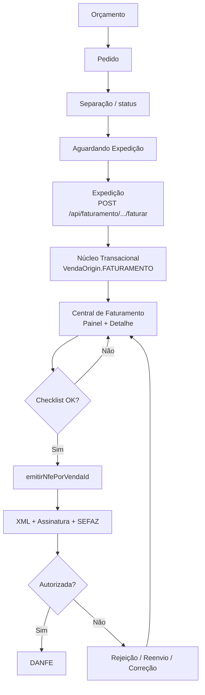

# Arquitetura Comercial/Fiscal V4 — CDS Sistemas

| Campo | Valor |
|---|---|
| **Versão** | **4.0** |
| **RC de congelamento** | **RC4.1.0** |
| **Status** | **CONGELADA** |
| **Data** | 2026-07-25 |
| **Escopo** | Fluxo Pedido → Expedição → Núcleo → Central de Faturamento → NF-e → DANFE |

> Novas funcionalidades fiscais (MDF-e, CT-e, CC-e, Manifestação destinatário, etc.) devem entrar como **módulos independentes**, sem alterar o fluxo principal V4.

Documentos relacionados:
- [Marco de congelamento](./ARQUITETURA_COMERCIAL_FISCAL_V4_CONGELAMENTO.md)
- [Núcleo Transacional](./NUCLEO_TRANSACIONAL_VENDA_V1.md)
- [Constituição CDS](./ARQUITETURA_OFICIAL_CDS_V1.md)
- Nomenclatura UI: `frontend/shared/js/cds-nomenclatura.js`

---

## 1. Arquitetura

### Princípio

| Camada | Responsabilidade | Não faz |
|---|---|---|
| **Comercial (Pedido)** | Orçamento, pedido, fila, confirmação fiscal de estoque | Criar venda; emitir NF-e |
| **Logístico / Expedição** | Concluir venda no Núcleo (`VendaOrigin.FATURAMENTO`) | Emitir NF-e; alterar XML/SOAP |
| **Núcleo Transacional** | Estoque + financeiro da venda | Emitir documento fiscal modelo 55 |
| **Central de Faturamento** | Checklist, emissão, monitoramento, documentos | Criar venda; alterar estoque |
| **Motor NF-e** | XML, assinatura, SOAP, retorno, DANFE | Decidir fluxo comercial |

### Fluxograma canônico



### Alias histórico (não confundir)

| UI | API / path | Recurso licença | Papel V4 |
|---|---|---|---|
| **Expedição** | `/api/faturamento` | `expedicao` (alias `faturamento`) | Comercial |
| **Central de Faturamento** | `/api/central-faturamento` | `nfe` | Fiscal operacional |
| **NF-e Emitidas** | `/api/nfe` | `nfe` | Consulta/eventos pós-emissão |

---

## 2. Responsabilidades por módulo

| Módulo | Arquivos-chave |
|---|---|
| Pedidos | `PedidoOperacionalService`, `rotas/pedidos.js`, `frontend/erp/js/pedidos.js` |
| Expedição | `FaturamentoService.faturarPedido`, `rotas/faturamento.js`, `faturamento.js` |
| Núcleo | `VendaApplicationService`, `VendaOrigin` |
| Central | `CentralFaturamentoService`, `CentralPainelOperacionalService`, `central-faturamento.js` |
| Emissão NF-e | `nfeEmissorVenda`, `xmlBuilderNfeVenda`, signer, soap |
| Pós-emissão | `nfeCentralService`, `nfeOperacionalService`, `nfe-central.js` |

**Invariante congelada:** `FaturamentoService.faturarPedido` **não** chama `emitirNfePorVendaId`.

**Emissão canônica:** `POST /api/central-faturamento/vendas/:vendaId/emitir`  
**Legado (deprecado):** `POST /api/faturamento/vendas/:vendaId/nfe/emitir` (header `Deprecation: true`)

---

## 3. APIs — Central de Faturamento

Base: `/api/central-faturamento` · Auth: JWT · Gate: `exigirRecurso('nfe')`

| Método | Path | Função |
|---|---|---|
| GET | `/painel` | Pacote painel (dashboard + fila + SEFAZ + rejeições + eventos) |
| GET | `/dashboard` | Indicadores |
| GET | `/sefaz` | Status SEFAZ |
| GET | `/rejeicoes` | Painel de rejeições |
| GET | `/eventos` | Timeline global |
| POST | `/lote` | Ações em lote |
| GET | `/fila` | Fila operacional (filtros) |
| GET | `/vendas/:vendaId` | Pacote detalhe |
| GET | `/vendas/:vendaId/checklist` | Pendências |
| PUT | `/vendas/:vendaId/dados-fiscais` | Salvar natureza/CFOP/obs |
| POST | `/vendas/:vendaId/emitir` | Emitir NF-e |
| POST | `/vendas/:vendaId/reenviar` | Reenviar |
| GET | `/vendas/:vendaId/xml` | XML |
| GET | `/vendas/:vendaId/danfe` | DANFE |
| POST | `/vendas/:vendaId/consultar` | Consultar situação |
| POST | `/notas/:notaId/cancelar` | Cancelar |

### Contrato de erro (Central)

```json
{
  "success": false,
  "error": "mensagem",
  "mensagem": "mensagem",
  "codigo": "CHECKLIST_BLOQUEADO",
  "checklist": { }
}
```

HTTP: `400` checklist/negócio · `403` módulo · `404` não encontrado · `500` interno.

---

## 4. Eventos

Fontes: `nfe_operacional_logs` + `auditoria` (módulo `nfe`).

Exemplos de ações: emitir, reenviar, consultar, cancelar, imprimir DANFE, alterar dados fiscais.

Expostos em: `GET /api/central-faturamento/eventos` e painel inicial.

---

## 5. Motores (limites V4)

| Motor | Papel no V4 |
|---|---|
| Motor Comercial / F×NF | Disponibilidade fiscal no Pedido |
| Núcleo Transacional | Conclusão da venda |
| Emissor NF-e 55 | Documento fiscal |
| Central Entradas / Manifestação | **Fora** deste fluxo (módulo separado; docs `RC4.*` Entradas ≠ Faturamento V4) |

A plataforma de expansão futura (`TIPOS_DOCUMENTO_FISCAL` no painel) já lista stubs: NFC-e, MDF-e, CT-e, CC-e, Manifestação, Eventos.

---

## 6. Permissões (estrutura preparada)

Catálogo: `backend/services/faturamento/permissoesComercialFiscalV4.js`  
Registradas em `PERMISSOES_DISPONIVEIS` (`auth.js`).

| Código | Quem / o quê |
|---|---|
| `expedicao_expedir` | Expedir pedido |
| `nfe_emitir` | Emitir NF-e |
| `nfe_cancelar` | Cancelar |
| `nfe_reenviar` | Reenviar |
| `nfe_consultar` | Consultar situação |
| `nfe_exportar_xml` | XML |
| `nfe_reimprimir_danfe` | DANFE |
| `nfe_alterar_dados` | Dados fiscais |
| `nfe_acoes_lote` | Lote |

**Gate atual em produção:** módulo licenciado (`nfe` / `expedicao`) + JWT.  
**RBAC granular:** preparado (`avaliarPermissaoV4`); se o usuário não tiver nenhuma permissão V4, modo **compat** (não quebra operação).

---

## 7. Checklist operacional (antes de emitir)

Validado na Central (RC4.0.1):

- Cliente: CPF/CNPJ, Nome, CEP, Município, UF, Endereço, Indicador IE  
- Natureza, CFOP  
- Produtos: NCM, configuração fiscal, itens do Motor  
- Certificado instalado e válido  
- Série, numeração, ambiente  
- CSC (N/A para NF-e 55)  
- XML pronto  

Qualquer item 🔴 → **bloqueia Emitir** com: *Existem pendências fiscais que impedem a emissão.*

---

## 8. Guia do operador

1. Cadastre/confirme o **Pedido** (cliente e itens fiscais ok).  
2. Envie para **Expedição**.  
3. Em **Expedição**, confira valores e clique **Expedir** (gera a venda — sem NF-e).  
4. Abra a **Central de Faturamento** (painel).  
5. Filtre a fila → **Abrir** a venda.  
6. Resolva **Pendências** (cliente/produto/certificado).  
7. Confira **Resumo Fiscal** e **Emitir NF-e**.  
8. Use **Documentos** (XML/DANFE/chave) e acompanhe **Timeline** / **Log SEFAZ**.  
9. Em rejeição: corrija cadastro → **Reenviar** ou emita de novo conforme status.

**Homologação:** badge/alerta de ambiente — não use para cliente final como produção.

---

## 9. Guia do suporte

| Sintoma | Onde olhar |
|---|---|
| Fila Expedição vazia | Pedido status `AGUARDANDO_FATURAMENTO`; recurso `expedicao` |
| Após expedir, sem NF-e | Esperado — ir à Central |
| Emitir bloqueado | Checklist 🔴; mensagem de bloqueio; cadastro cliente/NCM |
| `DEST_SEM_DOCUMENTO` | CPF/CNPJ do cliente |
| SEFAZ rejeição | Painel Rejeições + Log SEFAZ + XML enviado (`logs/nfe/`) |
| Certificado | Config fiscal + item checklist cert |
| Dual emissão | Preferir `/api/central-faturamento/.../emitir`; legado em `/api/faturamento/.../nfe/emitir` |
| Trace emissão | `backend/services/fiscal/nfeTrace.js` → `logs/nfe/trace/` |

Reinício Electron necessário após mudanças em `frontend/erp/js/central-faturamento.js`.

---

## 10. Testes de regressão (marcadores)

| Suite | Cobertura |
|---|---|
| `tests/faturamento/rc400-*.test.js` | Expedição sem NF-e; Central |
| `tests/faturamento/rc401-*.test.js` | Pendências, timeline, documentos |
| `tests/faturamento/rc402-*.test.js` | Painel, dashboard, lote |
| `tests/faturamento/rc410-*.test.js` | Congelamento V4 |
| `tests/plataforma/rc801-*.test.js` | Nomenclatura comercial×fiscal |
| `tests/plataforma/rc803-*.test.js` | Expedição independente do fiscal |

---

## 11. Dívida conhecida (aceitável no freeze)

1. UI **NF-e Emitidas** coexistindo com Central (papéis distintos documentados).  
2. Path `/api/faturamento` = Expedição (alias histórico).  
3. Separação ainda majoritariamente status, não motor dedicado.  
4. RBAC granular preparado, ainda não obrigatório.  
5. Relatório `logs/nfe/trace/RELATORIO-RC3.16.11.md` descreve fluxo pré-Central — **supersedido** por este documento.
