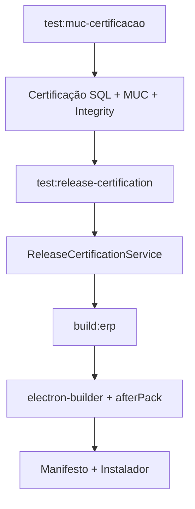

# Arquitetura — Certificação Funcional de Release (RC4.32.0)

## Objetivo

Validar automaticamente os principais fluxos de negócio do CDS ERP antes da distribuição oficial, complementando as certificações RC4.31.x (SQL, build, app.asar).

## Componentes

```
backend/certification/
├── ReleaseCertificationService.js   # Orquestrador das 12 etapas
├── ReleaseCertificationMetrics.js   # Tempo, memória, CPU, SQL
└── ReleaseCertificationReporter.js  # JSON + MD + PDF

tests/e2e/release-certification/
├── run.js                           # Entry point
└── helpers/
    ├── apiClient.js                 # HTTP login/ping
    ├── serverBootstrap.js           # Servidor efêmero (DB isolado)
    └── asarValidator.js             # Valida pacote instalado
```

## Fluxo do pipeline



## Etapas certificadas

| # | Módulo | Validação |
|---|--------|-----------|
| 1 | Inicialização | DB, tabelas, app.asar |
| 2 | Login | HTTP POST /api/auth/login |
| 3 | Produtos | CRUD + embalagem CX |
| 4 | Compras | NF-e fixture → Central |
| 5 | Financeiro | Parser parcelas XML |
| 6 | Estoque | Fiscal / não fiscal |
| 7 | MIIP/MUC | Simulação CX×12→120 UN |
| 8 | Central | Processamento documento |
| 9 | NFC-e | Homologação dest.xNome |
| 10 | NF-e | Parser autorização cStat=100 |
| 11 | Relatórios | Endpoints + queries |
| 12 | Performance | Métricas consolidadas |

## Relatórios gerados

- `docs/build/release-certification-report.json`
- `docs/build/release-certification-report.md`
- `docs/build/release-certification-report.pdf`

## Comandos

```bash
npm run test:release-certification   # Certificação funcional isolada
npm run build:erp                    # Inclui certificação funcional
npm run release                      # Pipeline completo oficial
```

## Garantia

Toda versão gerada por `build:erp` ou `release` passou pelos fluxos críticos de negócio sobre código homologado idêntico ao `app.asar` (RC4.31.7).
