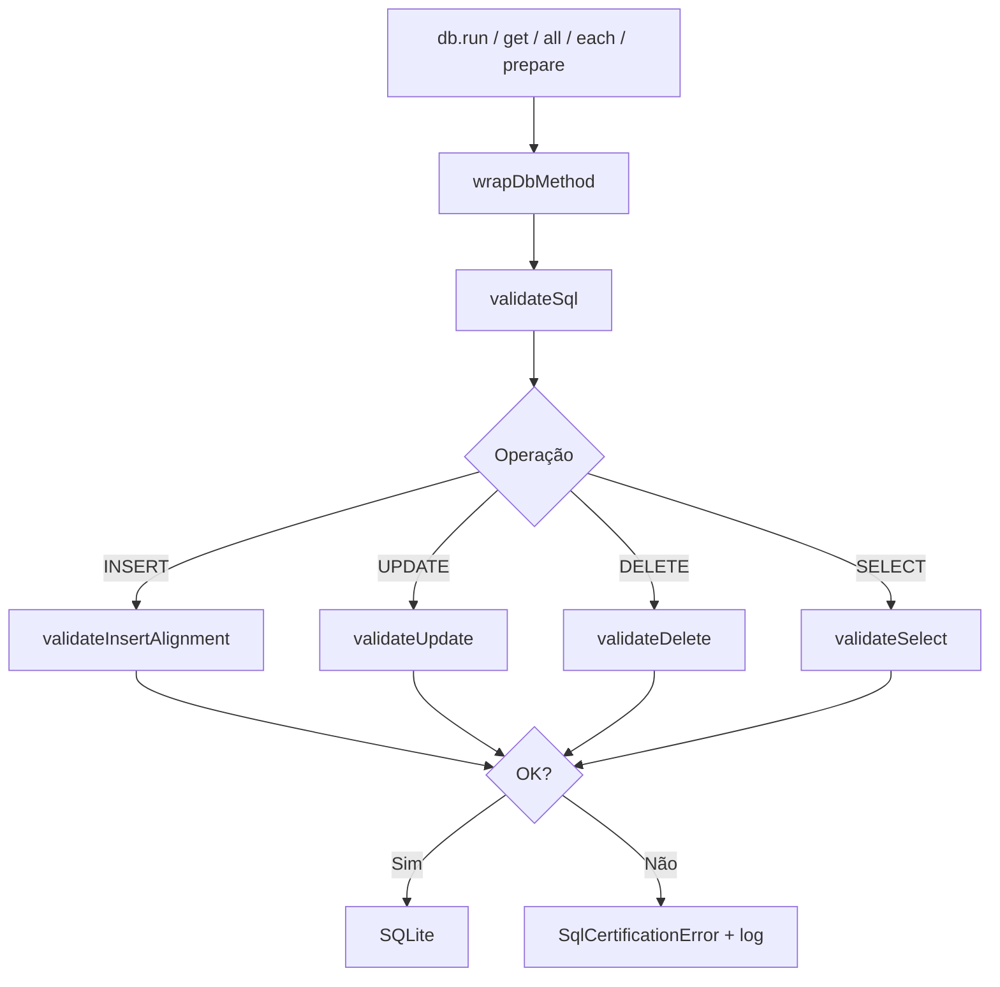

# Arquitetura — Camada Universal de Certificação SQL (RC4.31.6)

## Objetivo

Impedir que inconsistências SQL (`INSERT`, `UPDATE`, `DELETE`, `SELECT` e prepared statements) cheguem ao SQLite em runtime ou sejam distribuídas em builds de produção.

## Componentes

```
backend/lib/
├── validateInsertAlignment.js      # RC4.31.5 — alinhamento colunas/slots INSERT
├── scanInsertAlignmentInSource.js  # RC4.31.5 — auditoria estática INSERT
├── scanSqlCertificationInSource.js # RC4.31.6 — auditoria estática universal
└── sqlCertification/
    ├── index.js                    # validateSql, aplicarCertificacaoSql
    ├── common.js                   # parsers, SqlCertificationError
    └── logger.js                   # logs + relatório por operação
```

## Fluxo Runtime



`backend/database.js` chama `aplicarCertificacaoSql(db)` após a inicialização do schema.

## Validações por operação

| Operação | Validações |
|----------|------------|
| INSERT | colunas vs slots vs parâmetros (tabelas monitoradas) |
| UPDATE | SET/WHERE placeholders, duplicatas, parâmetros |
| DELETE | WHERE obrigatório (exceto `-- allow-full-delete`) |
| SELECT | placeholders vs parâmetros, `undefined` rejeitado |
| PRAGMA/DDL/TRANSACTION | ignorados automaticamente |

## Auditoria estática

`scanSqlCertificationInSource.js` percorre 18 módulos críticos (Produtos, Compras, Vendas, Financeiro, Fiscal, MIIP, Central Entradas, etc.) e gera relatório com arquivo, linha, operação e inconsistências.

## Pipeline

- `npm run test:sql-universal-certification` — regressão RC4.31.6
- `npm run test:sql-insert-alignment` — regressão RC4.31.5
- `npm run test:muc-certificacao` — inclui ambos + MUC
- `npm run build:erp` — bloqueia build se certificação falhar

## Escape hatch

SQL de manutenção interna pode usar `-- cds-skip-sql-cert` no texto do comando.

DELETE completo autorizado: `-- allow-full-delete`.
