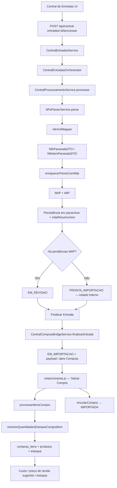

# Auditoria completa do fluxo de importação da NF-e

## Objetivo

Documentar, de ponta a ponta, o pipeline de importação da NF-e na Central de Entradas, incluindo:

- leitura do XML;
- enriquecimento/associação MIIP;
- criação dos itens da compra;
- cálculo do custo;
- atualização do estoque;
- cálculo da venda sugerida;
- todos os pontos onde a quantidade do XML é utilizada diretamente.

---

## 1. Visão geral do pipeline

O fluxo oficial começa na Central de Entradas, passa pelo parse do XML, pelo enriquecimento MIIP/MIP e, se houver aprovação da revisão, segue para a criação da compra.

---

## 2. Mapa do pipeline por camada

### 2.1 Entrada e disparo

- Interface da Central de Entradas: [frontend/erp/js/central-entradas.js](../../frontend/erp/js/central-entradas.js)
- Rota oficial: [backend/rotas/central-entradas.js](../../backend/rotas/central-entradas.js)
- Fachada: [backend/motores/central-entradas/CentralEntradasService.js](../../backend/motores/central-entradas/CentralEntradasService.js)
- Orquestrador: [backend/motores/central-entradas/CentralEntradasOrchestrator.js](../../backend/motores/central-entradas/CentralEntradasOrchestrator.js)

Fluxo principal:

1. O usuário aciona processamento do documento na Central.
2. A rota POST `/api/central-entradas/:id/processar` chama o serviço da Central.
3. O orchestrator delega para o pipeline de processamento oficial.

### 2.2 Leitura e transformação do XML

- Parser oficial: [backend/shared/nfe/NFeParserService.js](../../backend/shared/nfe/NFeParserService.js)
- Mapper XML → DTO: [backend/shared/nfe/mappers/nfeXmlMapper.js](../../backend/shared/nfe/mappers/nfeXmlMapper.js)
- DTO de itens: [backend/shared/nfe/contracts/NfeItemParseadoDTO.js](../../backend/shared/nfe/contracts/NfeItemParseadoDTO.js)
- DTO da nota: [backend/shared/nfe/contracts/NfeParseadaDTO.js](../../backend/shared/nfe/contracts/NfeParseadaDTO.js)

Aqui ocorre a leitura do XML e a primeira transformação estruturada do conteúdo fiscal para o formato interno do ERP.

### 2.3 Enriquecimento MIIP / MIP

- Enriquecimento MIIP: [backend/shared/nfe/enriquecerParseComMiip.js](../../backend/shared/nfe/enriquecerParseComMiip.js)
- Serviço MIIP XML: [backend/motores/miip/services/MiipImportacaoXmlService.js](../../motores/miip/services/MiipImportacaoXmlService.js)
- Serviço MIP (identificação de produto): [backend/motores/produto-identidade/services/EntradasProdutoIdentificacaoService.js](../../backend/motores/produto-identidade/services/EntradasProdutoIdentificacaoService.js)

O MIIP associa os itens da NF-e a produtos já cadastrados ou indica pendências para revisão.

### 2.4 Persistência do parse e status

- Serviço de processamento: [backend/motores/central-entradas/services/CentralProcessamentoService.js](../../backend/motores/central-entradas/services/CentralProcessamentoService.js)
- Repositório dos documentos: [backend/motores/central-entradas/repositories/CentralDocumentosRepository.js](../../backend/motores/central-entradas/repositories/CentralDocumentosRepository.js)

O resultado do parse é armazenado em `parseJson` e o resumo MIIP em `miipResumoJson`.

### 2.5 Revisão MIIP e abertura da compra

- Ponte para compras: [backend/motores/central-entradas/services/CentralComprasBridgeService.js](../../backend/motores/central-entradas/services/CentralComprasBridgeService.js)
- Rota de revisão: [backend/rotas/central-entradas.js](../../backend/rotas/central-entradas.js)
- Fluxo de compra: [backend/rotas/compras.js](../../backend/rotas/compras.js)

Se o documento sai do estado de revisão, a compra é aberta e os itens são gravados na rotina de compras.

---

## 3. Onde o XML é lido

### 3.1 Leitura inicial do XML

- [backend/shared/nfe/NFeParserService.js](../../backend/shared/nfe/NFeParserService.js)

Ponto de entrada oficial.

Responsabilidade:

- recebe a string ou buffer do XML;
- valida se o conteúdo não está vazio;
- converte o XML para objeto via `xml2js`;
- delega o mapeamento para o parser oficial.

### 3.2 Transformação para o modelo interno

- [backend/shared/nfe/mappers/nfeXmlMapper.js](../../backend/shared/nfe/mappers/nfeXmlMapper.js)

Ponto em que os dados fiscais do XML viram DTOs do ERP.

Campos principais mapeados:

- `prod.qCom` → `quantidade`;
- `prod.qTrib` → `quantidade_tributavel`;
- `prod.vUnCom` → `preco_unitario`;
- `prod.vProd` → `subtotal`;
- `prod.xProd` → `produto_nome`;
- `prod.cProd` → `codigo_fornecedor`;
- `prod.cEAN` / `prod.cEANTrib` → `codigo_barras` / `gtin`.

### 3.3 Persistência do parse

- [backend/motores/central-entradas/services/CentralProcessamentoService.js](../../backend/motores/central-entradas/services/CentralProcessamentoService.js)

O parse já estruturado é salvo em `parseJson` e, em seguida, o resumo MIIP é salvo em `miipResumoJson`.

---

## 4. Onde ocorre a associação MIIP

### 4.1 MIIP no processamento da NF-e

- [backend/shared/nfe/enriquecerParseComMiip.js](../../backend/shared/nfe/enriquecerParseComMiip.js)
- [backend/motores/miip/services/MiipImportacaoXmlService.js](../../backend/motores/miip/services/MiipImportacaoXmlService.js)

O fluxo faz:

1. lê os itens parseados do XML;
2. cria um contexto de importação;
3. chama o MIIP para identificar o produto;
4. marca se o item precisa confirmação, cadastro ou foi associado automaticamente.

Resultado relevante:

- `item.miip_resultado`;
- `item.miip_sugestao`;
- `item.produto_id` (quando o MIIP resolve automaticamente);
- `miipImportacao` no payload final.

### 4.2 MIP complementar

- [backend/shared/nfe/enriquecerParseComMiip.js](../../backend/shared/nfe/enriquecerParseComMiip.js)

Em paralelo, há um passo MIP que pode preencher `produto_id` em itens ainda sem associação.

---

## 5. Onde os itens da compra são criados

### 5.1 Entrada da compra

- [backend/rotas/compras.js](../../backend/rotas/compras.js)

A criação real dos itens da compra ocorre na função `processarItensCompra`.

### 5.2 Transformação para o modelo de compra

- [backend/rotas/compras.js](../../backend/rotas/compras.js)

No processamento de cada item, o fluxo faz:

- resolve a quantidade de estoque conforme a unidade e a conversão;
- resolve o produto alvo;
- calcula o custo e o preço de venda sugerido;
- grava na tabela `compras_itens`;
- atualiza os saldos do produto em `produtos`.

---

## 6. Cálculo do custo

### 6.1 Função central para cálculo

- [backend/lib/motorConversaoUnidades.js](../../backend/lib/motorConversaoUnidades.js)

Regras principais:

- `resolverCustoUnitarioCadastro()` calcula o custo unitário do item de compra;
- `resolverPrecosCadastroAposCompra()` calcula o preço de compra e o preço de venda sugerido;
- `calcularSubtotalFinanceiroItemCompra()` calcula o subtotal financeiro para a compra.

### 6.2 Uso no fluxo de compras

- [backend/rotas/compras.js](../../backend/rotas/compras.js)

No `INSERT INTO compras_itens`, o valor de custo é persistido em:

- `preco_unitario`;
- `subtotal`;
- `custo_unitario_final`;
- `custo_por_kg` (quando aplicável).

---

## 7. Atualização do estoque

### 7.1 Quantidade de estoque derivada do XML

- [backend/lib/motorConversaoUnidades.js](../../backend/lib/motorConversaoUnidades.js)

A função `resolverQuantidadesEstoqueCompraItem()` é o ponto central para separar:

- `quantidade_fiscal`;
- `quantidade_nao_fiscal`;
- `quantidade`;
- `quantidade_convertida`.

### 7.2 Persistência do estoque

- [backend/rotas/compras.js](../../backend/rotas/compras.js)

No `UPDATE produtos`, o fluxo atualiza:

- `saldo_fiscal`;
- `saldo_nao_fiscal`;
- `estoque_atual`;
- `preco_compra`;
- `preco_venda`.

Ou seja, a quantidade que entra pela NF-e vira saldo fiscal/estoque real do produto.

---

## 8. Cálculo da venda sugerida

### 8.1 Origem do valor

- [backend/lib/motorConversaoUnidades.js](../../backend/lib/motorConversaoUnidades.js)
- [backend/rotas/compras.js](../../backend/rotas/compras.js)

A venda sugerida é derivada principalmente de:

- `preco_unitario` do item parseado;
- `custo_unitario_final`;
- `margem_lucro`;
- `preco_venda_sugerido` que já vem do parse.

### 8.2 Persistência da venda sugerida

No fluxo de compra, o valor é gravado em `preco_venda_sugerido` e, quando permitido, em `preco_venda` do produto.

---

## 9. Pontos em que a quantidade do XML é usada diretamente

Esta é a parte mais importante da auditoria.

| Etapa | Arquivo | Uso da quantidade do XML |
|---|---|---|
| Parse inicial | [backend/shared/nfe/mappers/nfeXmlMapper.js](../../backend/shared/nfe/mappers/nfeXmlMapper.js) | `prod.qCom` vira `quantidade`; `prod.qTrib` vira `quantidade_tributavel` |
| DTO do item | [backend/shared/nfe/contracts/NfeItemParseadoDTO.js](../../backend/shared/nfe/contracts/NfeItemParseadoDTO.js) | O valor de quantidade é materializado no contrato do item parseado |
| Persistência do parse | [backend/motores/central-entradas/services/CentralProcessamentoService.js](../../backend/motores/central-entradas/services/CentralProcessamentoService.js) | O parse é persistido em `parseJson` para uso posterior |
| Payload de compra | [backend/motores/central-entradas/services/CentralComprasBridgeService.js](../../backend/motores/central-entradas/services/CentralComprasBridgeService.js) | O payload usa o `parseJson` persistido |
| Conversão de compra | [backend/lib/motorConversaoUnidades.js](../../backend/lib/motorConversaoUnidades.js) | `resolverQuantidadesCompraItem()` e `resolverQuantidadesEstoqueCompraItem()` usam a quantidade para separar fiscal / não fiscal |
| Criação de itens da compra | [backend/rotas/compras.js](../../backend/rotas/compras.js) | `qtdTotal`, `qtdFiscal`, `qtdNaoFiscal` são usados para gravar `compras_itens` |
| Atualização de estoque | [backend/rotas/compras.js](../../backend/rotas/compras.js) | A quantidade é usada para incrementar `saldo_fiscal`, `saldo_nao_fiscal` e `estoque_atual` |
| Cálculo financeiro e subtotal | [backend/lib/motorConversaoUnidades.js](../../backend/lib/motorConversaoUnidades.js) | A quantidade entra no cálculo do subtotal finaI |

### Resumo executivo

A quantidade do XML é usada diretamente em três grandes pontos:

1. no parse inicial (`qCom` / `qTrib`);
2. na conversão de compra para estoque fiscal e não fiscal;
3. na gravação dos itens e no saldo do produto.

---

## 10. Rastabilidade final

### O que fica rastreável hoje

- XML original: persistido no documento da Central.
- Parse estruturado: salvo em `parseJson`.
- MIIP: salvo em `miipResumoJson`.
- Itens da compra: gravados em `compras_itens`.
- Saldo/estoque: atualizado em `produtos`.
- Custo e preço: persistidos em campos de compra/produto.

### O que ainda precisa ser reforçado na operação

- registrar, em log ou auditoria, a origem exata de cada quantidade usada (`qCom`, `qTrib`, split fiscal/não fiscal);
- manter um traço explícito entre `parseJson → compras_itens → produtos` para auditoria de estoque.

---

## 11. Conclusão

O fluxo de importação da NF-e está totalmente documentado do ponto de vista estrutural:

- o XML é lido no parser;
- o conteúdo é transformado em DTOs;
- o MIIP enriquece a associação;
- o parse é persistido;
- o fluxo de compras usa esses dados para criar itens, custo, estoque e preço sugerido.

A quantidade do XML é utilizada de forma rastreável em todos os pontos centrais do pipeline, com persistência final em estoque e compra.
