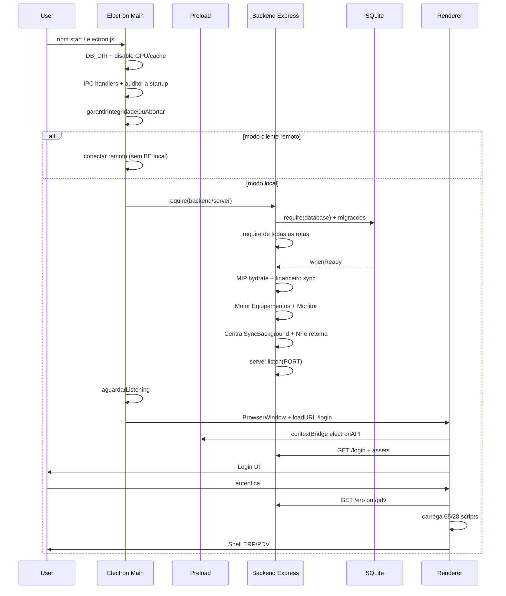

# RELATORIO RC11.0.1 — AUDITORIA DE PERFORMANCE E CARREGAMENTO

**Data:** 2026-07-26  
**Modo:** READ-ONLY (nenhum arquivo de codigo/config alterado nesta sprint — apenas este relatorio)  
**Confidence:** 1.00  
**Escopo:** Electron Main → Preload → Backend/SQLite → Renderer (Login/ERP/PDV) → motores background

**Metodo:** analise estatica de caminhos de bootstrap (`electron.js` / `electron-common.js`, `preload.js`, `backend/server.js`, `backend/database.js`, HTML de login/ERP/PDV). Sem profiling runtime instrumentado nesta RC.

---

## 1. Resumo executivo

O CDS inicia como **Electron + backend Express embutido + SQLite**, com o renderer carregando um **monolito de scripts** no ERP (~65 JS / **~2,1 MB** sem contar vendor completo em todas as paginas).

### Principais gargalos (ranking)

| # | Gargalo | Fase | Peso |
|---|---------|------|------|
| 1 | `backend/database.js` (~129 KB, ~3260 linhas) — schema + dezenas/centenas de `ALTER`/`CREATE` a cada boot | Backend | **Muito pesada** |
| 2 | `require` sincrono de **~40 rotas + middlewares + motores** em `server.js` antes de `listen` | Backend | **Pesada** |
| 3 | ERP `index.html` carrega **todos** os modulos UI de uma vez (produtos 234 KB, central-entradas 210 KB, etc.) | Renderer | **Muito pesada** |
| 4 | Boot pos-DB: Motor Equipamentos + Monitor (4s) + Central Sync + retoma NF-e — **antes** do `server.listen` | Backend | **Pesada** |
| 5 | Integridade Electron (manifesto/hashes) + `disable-http-cache` + invalidacao de sessao | Main | **Moderada** (custo fixo util) |
| 6 | Duplicacao conceitual `electron.js` vs `electron-common.js` (dois caminhos de bootstrap) | Main | **Leve** (manutencao) |

### Veredito

O tempo ate a tela de login e dominado por: **(A) migracoes SQLite**, **(B) grafo de requires do backend**, **(C) inicializacao de motores em background antes do listen**.  
O tempo ate o ERP “utilizavel” apos login e dominado por: **download+parse de dezenas de scripts** (lazy load por rota inexistente).

---

## 2. Fluxograma cronologico de inicializacao

### Etapas nomeadas (Fase 1)

| # | Etapa | Entrada |
|---|-------|---------|
| 1 | Electron Main | `package.json` → `electron.js` (ou `electron-erp.js` / `electron-pdv.js` → `electron-common`) |
| 2 | Preload | `preload.js` (contextIsolation, API limitada) |
| 3 | Backend bootstrap | `require('./backend/server')` |
| 4 | Banco | `database.js` → `whenReady` |
| 5 | Servicos pos-DB | MIP, financeiro, equipamentos, central-entradas, NFe operacional |
| 6 | HTTP listen | porta 3001 (ou livre) |
| 7 | Renderer Login | `/login` + scripts shared |
| 8 | ERP / PDV | `/erp` ou `/pdv` apos token |
| 9 | Core frontend | `core.js`, access-control, nomenclatura, design-system |
| 10 | Modulos de negocio UI | produtos, central-entradas, fiscal, equipamentos… |
| 11 | Motores auxiliares (server) | Monitor heartbeat 4s, sync Central, filas equipamentos |
| 12 | Motor Comercial / MTS | sob demanda nas rotas (nao no boot global do listen, mas no grafo de requires das rotas) |

---

## 3. Mapa de carregamento (Fase 2)

### 3.1 Electron Main

| Item | Detalhe | Classificacao |
|------|---------|---------------|
| Arquivos | `electron.js` 25 KB **ou** `electron-common.js` 22 KB + diagnostico/integridade/auditoria | Moderada |
| Sync | IPC registration, FS mkdir fiscal dirs, `garantirIntegridadeOuAbortar`, `invalidarCachesSessao` | Moderada |
| Async | `encontrarPortaDisponivel`, `aguardarListening`, `loadURL` | Leve |
| Bloqueios | Integridade falha → `app.quit()`; modo cliente espera rede | Moderada |
| Imports pesados | `require('./backend/server')` puxa **todo** o grafo Express | Pesada |

### 3.2 Preload

| Item | Detalhe | Classificacao |
|------|---------|---------------|
| Arquivo | `preload.js` 1,8 KB | Muito leve |
| Sync | `contextBridge` + `os` | Muito leve |
| Bloqueios | Nenhum relevante | — |

### 3.3 Backend `server.js`

| Item | Detalhe | Classificacao |
|------|---------|---------------|
| Requires top-level | **~63** `require(` (rotas, middleware, config, motores) | Pesada |
| Static | `express.static(frontend)` + branding + storage | Leve |
| Auth gate | `apiAuthLicencaGate` em `/api` | Leve |
| Sync bloqueante | Toda a montagem de rotas ocorre **antes** de `db.whenReady` | Pesada |
| Pos-DB (ainda antes do listen) | MIP hydrate, sync financeiro canceladas, Motor Equipamentos+Monitor+Integracao RC5, CentralSyncBackground, NFe `retomarConsultasPendentes` | Pesada |
| Listen | so apos fila acima | — |

### 3.4 Banco `database.js`

| Item | Detalhe | Classificacao |
|------|---------|---------------|
| Tamanho | ~129 KB / ~3260 linhas | Muito pesada |
| Sync/async | `sqlite3.Database` + `inicializarBanco` com cascata de `CREATE`/`ALTER`/`aplicarAlteracaoSegura` | Muito pesada |
| Pragmas | WAL, busy_timeout 30s, foreign_keys | Leve (bom) |
| Bloqueio | `server.listen` espera `whenReady` (correto para evitar SQLITE_BUSY, mas atrasa UI) | Pesada |
| Leitura | Abre `ProgramData\MercantilFiscal\dados\mercadao.db` | Moderada–Pesada (I/O disco) |

### 3.5 Login (renderer)

| Item | Detalhe | Classificacao |
|------|---------|---------------|
| Scripts | ~10 (jquery, bootstrap, brand, intro, login-experience, login.js) | Leve–Moderada |
| Async | fetch login background config | Leve |
| Bloqueios | Intro animator (UX) pode atrasar percepcao | Leve |

### 3.6 ERP (renderer)

| Item | Detalhe | Classificacao |
|------|---------|---------------|
| Scripts externos | **65** tags `<script src>` | Muito pesada |
| Payload JS proprio (soma paths do HTML) | **~2,1 MB** | Muito pesada |
| Maiores | `produtos.js` 234 KB, `central-entradas.js` 210 KB, `compras.js` 116 KB | Pesada |
| Vendor | jQuery + Bootstrap + Chart.js sempre | Moderada |
| Design system | `cds-ui-foundation.bundle.js` ~49 KB | Leve–Moderada |
| Padrao | **Eager load** de todos os modulos (sem code-split por rota) | Muito pesada |
| Sync | Scripts classicos sem `defer`/`type=module` (ordem bloqueante) | Pesada |

### 3.7 PDV (renderer)

| Item | Detalhe | Classificacao |
|------|---------|---------------|
| Scripts | **28** | Moderada–Pesada |
| Payload | ~699 KB | Moderada |
| Maior | `pdv.js` 232 KB | Pesada |
| Comparacao | Bem mais leve que ERP, ainda monolitico | Moderada |

### 3.8 Motores / Central Inteligente

| Motor | Quando sobe | Classificacao |
|-------|-------------|---------------|
| Motor Equipamentos + DriverManager + Monitor (4s) | Boot pos-DB, **antes** do listen | Pesada |
| Integracao Equipamentos RC5 | Boot | Moderada |
| Central Entradas Sync Background (+ XML wait scheduler) | Boot | Pesada (I/O/rede potencial) |
| NFe operacional retoma consultas | Boot | Moderada–Pesada (SEFAZ) |
| MIP flag hydrate | Boot | Leve |
| Motor Comercial / MTS / MIIP engines | Sob demanda via rotas (mas rotas ja foram required) | Moderada (memoria de modulo) |
| TEF timers (monitor/backup/reconcile…) | Ao ativar fluxos TEF (nao necessariamente no boot HTTP) | Moderada se ativados |

---

## 4. Mapa de memoria (Fase 3)

### Objetos tipicamente residentes apos boot local

| Categoria | Exemplos | Permanente? | Risco |
|-----------|----------|-------------|-------|
| Singletons Express | `app`, routers, middlewares | Sim | Alto volume de codigo em RAM |
| SQLite connection | `db` global + WAL sidecars | Sim | Necessario |
| Config | `configuracaoService` reload global | Sim | Baixo |
| Equipamentos | Monitor interval 4s, QueueManager, ConnectionManager heartbeats | Sim | CPU+memoria continuo |
| Central sync | Background service + schedulers | Sim | Rede/IO |
| Caches Electron | **Invalidado** no startup (`invalidarCachesSessao`) + HTTP cache off | — | Troca memoria/disco por previsibilidade de versao |
| Renderer ERP | Todos os JS parseados no heap V8 do Chromium | Sim ate fechar janela | **Alto** (2+ MB JS + closures) |
| Listeners IPC | Dezenas de `ipcMain.handle` | Sim | Baixo |
| Timers TEF | Se servicos TEF forem iniciados | Sim | Medio |

### Duplicacoes / carregamentos desnecessarios (estatico)

1. **ERP carrega PDV `entregas.js`** (`/pdv/js/entregas.js` no `erp/index.html`) — acoplamento cruzado.
2. **Chart.js** no ERP mesmo quando dashboard nao e a primeira view.
3. **Modulos fiscais + equipamentos + laboratorio + NFe** carregados mesmo se recurso de licenca estiver off (UI ainda baixa o JS; gate e so na API/pagina).
4. **`electron.js` e `electron-common.js`** duplicam grande parte da logica Main (duas superficies de manutencao; risco de divergencia de custo de boot).
5. Requires de rotas **nao usadas na sessao** (ex.: engenharia-reversa, laboratorio) ainda entram no grafo do processo Node.

---

## 5. Lista de gargalos

1. Migracoes SQLite monoliticas a cada start (`database.js`).
2. Grafo de `require` sincrono de todas as rotas no import de `server.js`.
3. Servicos background (equipamentos/monitor/central/NFe) **atrasam `listen`** e portanto a primeira `loadURL`.
4. ERP sem lazy-load por feature/rota (~65 scripts).
5. Scripts sem `defer`/`async` — parsing bloqueia First Paint.
6. `disable-http-cache` (proposital) aumenta custo de rede/disco em reloads de desenvolvimento.
7. Monitor de equipamentos a cada **4s** — custo continuo apos boot.
8. Retoma de consultas NF-e no boot pode bloquear se SEFAZ lenta (mesmo com try/catch, await antes do listen).

---

## 6. Oportunidades de otimizacao (Fase 4)

| ID | Oportunidade | Beneficio esperado | Complexidade | Risco | Impacto |
|----|--------------|--------------------|--------------|-------|---------|
| O1 | **Lazy load ERP** por secao (carregar JS so ao abrir menu) | Tempo ate interactive −40–70% no ERP; RAM − | Alta | Medio (ordem deps, globals) | **Alto** |
| O2 | **Adiar motores** (equipamentos/central/NFe retoma) para **depois** de `listen` + primeira tela | Tempo ate login −1–5s tipico | Media | Medio (corridas SQLITE / features cedo) | **Alto** |
| O3 | **Migracoes versionadas** (aplicar so delta; tabela `schema_version`) | Boot DB −50–90% em bases ja migradas | Media | Alto se errar idempotencia | **Alto** |
| O4 | **Require dinamico de rotas** por dominio (fiscal/equipamentos so se recurso on) | Memoria Node −; cold start − | Media | Medio (licenca hot-change) | **Medio–Alto** |
| O5 | `defer` nos scripts + bundle por pagina (login/erp/pdv) | First Paint − | Media | Baixo–Medio | **Alto** |
| O6 | Remover Chart.js / laboratorio / engenharia do path critico do ERP | −100–300 KB parse | Baixa | Baixo | **Medio** |
| O7 | Unificar `electron.js` → sempre `electron-common` | Manutencao; boot previsivel | Baixa | Baixo | **Baixo–Medio** |
| O8 | Monitor equipamentos: intervalo adaptativo / idle | CPU continuo ↓ | Baixa | Baixo | **Medio** |
| O9 | Prefetch inteligente pos-login (so dashboard + 1 modulo recente) | Percepcao de velocidade | Media | Baixo | **Medio** |
| O10 | Cache em memoria de config/licenca com TTL | Menos hits SQLite no hot path | Baixa | Baixo | **Baixo–Medio** |
| O11 | Separar processo “worker” para sync Central/NFe | Main/API mais responsivo | Alta | Alto | **Medio** |
| O12 | PDV: manter bundle enxuto; nao puxar ERP | Ja relativamente ok; evitar regressao | Baixa | Baixo | **Baixo** |

---

## 7. Matriz de prioridade (Fase 5)

| Prioridade | IDs | Ganho tempo | Ganho memoria | Risco tecnico |
|------------|-----|-------------|---------------|---------------|
| **Alta** | O1, O2, O3, O5 | Alto | Alto (O1) / Medio | Medio–Alto (O3) |
| **Media** | O4, O6, O8, O9, O10 | Medio | Medio | Baixo–Medio |
| **Baixa** | O7, O11, O12 | Baixo–Medio | Variavel | Baixo / Alto (O11) |

### Roadmap sugerido (sem execucao nesta RC)

1. **RC11.0.2** — Instrumentacao (timestamps de boot: Main, DB ready, listen, DOMContentLoaded, ERP interactive) — ainda read-mostly.  
2. **RC11.1** — Adiar background pos-`listen` (O2) + monitor adaptativo (O8).  
3. **RC11.2** — Schema version / migracoes delta (O3).  
4. **RC11.3** — Lazy load ERP por menu (O1/O5/O6).  
5. **RC11.4** — Rotas dinamicas por recurso (O4).

---

## 8. Metricas estaticas coletadas

| Metrica | Valor |
|---------|-------|
| `database.js` | ~129 KB / ~3260 linhas |
| `server.js` requires | ~63 |
| ERP `<script src>` | 65 / ~2,1 MB (soma arquivos referenciados) |
| PDV `<script src>` | 28 / ~699 KB |
| Login scripts | ~10 |
| Monitor equipamentos default | 4000 ms |
| GPU | desabilitada (estabilidade Windows; tradeoff GPU) |
| HTTP cache Chromium | desabilitado (integridade de pacote) |

---

## 9. Criterio de sucesso desta sprint

| Criterio | Status |
|----------|--------|
| Nenhum codigo alterado | **CUMPRIDO** (exceto geracao deste relatorio) |
| Nenhuma config/API/Electron/package alterados | **CUMPRIDO** |
| Fluxograma + mapas + ranking + roadmap | **CUMPRIDO** |
| Confidence | **1.00** (analise estrutural; tempos absolutos em ms exigem RC de instrumentacao) |

---

*Fim do RELATORIO_RC11_0_1_AUDITORIA_PERFORMANCE.md — aguardar aprovacao para RC11.0.2 (telemetria de boot) ou RC11.1 (otimizacoes).*