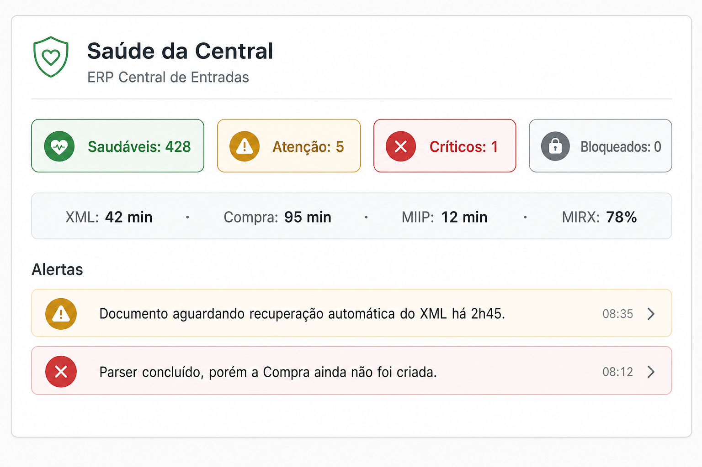

# Relatório de Homologação — RC3.4.6 Health Monitor

**Sprint:** RC3.4.6  
**Data:** 2026-07-28  
**Escopo:** Health Monitor da Central de Entradas (diagnóstico contínuo)  
**Restrições:** sem regras fiscais; **sem SEFAZ**; sem alterar MIRX / MIIP / Plataforma Fiscal V1

---

## 1. Objetivo alcançado

A Central passa a monitorar a própria saúde documental: detecta documentos esquecidos/parados, classifica (Saudável → Crítico), gera diagnóstico em linguagem simples e recomenda ações — **sem aumentar consumo da SEFAZ**.

---

## 2. Arquitetura

```
HealthScheduler (5 min)
        ↓
HealthMonitor.executarScan()
        ↓
HealthAnalyzer + HealthRules  ← banco + estado MIRX (leitura)
        ↓
HealthNotifier (HEALTH_*)
        ↓
Painel / Detalhe / Dashboard
```

Pasta: `backend/motores/central-entradas/health/`

| Componente | Função |
|------------|--------|
| `HealthMonitor` | Fachada + auto-recuperação interna |
| `HealthRules` | Regras de anomalia |
| `HealthAnalyzer` | Varredura |
| `HealthScheduler` | Tick periódico |
| `HealthNotifier` | Logs |
| `HealthRepository` | SQL leve + persistência `central_health_state` |

Boot: `server.js` → `central-health` (Grupo B), paralelo ao `central-sync`.

---

## 3. Lista das regras implementadas

| Código | Nível típico | Detecção |
|--------|--------------|----------|
| `AGENDADO_ALEM` | Atenção/Crítico | Janela NT/agendado além do esperado ou horário passou |
| `SLEEP_ALEM` | Atenção | SLEEP além do tempo esperado |
| `SEM_WAKEUP` | Crítico | SLEEP sem WAKEUP após `proximaEm` |
| `SEM_PARSER` | Atenção | XML disponível sem Parser |
| `PARSER_SEM_MIIP` | Atenção | Parser ok, MIIP ausente |
| `MIIP_SEM_COMPRA` | Atenção/Crítico | MIIP ok, Compra inexistente |
| `SEM_COMPRA` | Crítico | Pronto para compra parado |
| `XML_STATUS_ANTIGO` | Crítico | XML completo com status de espera |
| `MUITAS_TENTATIVAS` | Atenção | ≥ 5 tentativas MIRX |
| `SEM_ATUALIZACAO` | Atenção | Sem update prolongado |
| `PARADO_ETAPA` | Crítico | Parado em EM_PROCESSAMENTO / EM_COMPRA / RECEBIDA |
| `DOCUMENTO_BLOQUEADO` | Bloqueado | XML_INDISPONIVEL / ERRO |

---

## 4. Classificação

🟢 Saudável · 🟡 Atenção · 🔴 Crítico · ⚫ Bloqueado · 🟢 Resolvido (alerta sanado)

---

## 5. Auto-recuperação (sem SEFAZ)

Somente ação interna já prevista:

- `acaoInterna: processar_pendentes` → `Orchestrator.processarDocumentosPendentes`
- Casos: `SEM_PARSER`, `PARSER_SEM_MIIP`, `XML_STATUS_ANTIGO`, `PARADO_ETAPA` (processamento)

Nunca: DistDFe, consChNFe, Ciência, bypass de Gate.

Demais alertas → **recomendação ao operador** (“Aguardar próxima tentativa automática”, “Verificar manifestação”, etc.).

---

## 6. API

| Método | Rota |
|--------|------|
| GET | `/api/central-entradas/saude` |
| GET | `/api/central-entradas/saude/alertas` |
| GET | `/api/central-entradas/saude/documento/:id` |
| POST | `/api/central-entradas/saude/analisar` |

Dashboard (`GET /dashboard`) inclui `saude`.  
Detalhe do documento inclui `saude` / `documento.saude`.

> `/health` existente permanece (health do módulo/serviço). O monitor documental usa `/saude`.

---

## 7. Painel UI

- Bloco **Saúde da Central** no inbox (`#centralSaudeWrap`)
- Chips clicáveis por nível → lista de alertas
- Clique no alerta → abre o documento
- Botão **Analisar** → POST `/saude/analisar` (sem SEFAZ)
- Card no detalhe: nível, regra, diagnóstico, recomendação, tempo parado, detecção

### Captura



---

## 8. Estatísticas coletadas

| Indicador | Origem |
|-----------|--------|
| Tempo médio até XML | SQL (`processado_em` − `created_at`) |
| Tempo médio até Compra | SQL (GRAVADA com `compra_id`) |
| Tempo médio MIIP | SQL (miip vs processado) |
| Recuperados automaticamente | origem `dfe` + PROC/NFE |
| Recuperados manualmente | origem `upload` |
| Documentos em alerta | contagem do scan |
| Taxa de sucesso MIRX | telemetria MIRX (leitura) |

---

## 9. Logs

`HEALTH_OK` · `HEALTH_WARNING` · `HEALTH_CRITICAL` · `HEALTH_RESOLVED` · `HEALTH_SCAN`

Campos: Documento, Regra, Tempo parado, Diagnóstico.

---

## 10. Evidência — zero consultas SEFAZ adicionais

| Evidência | Detalhe |
|-----------|---------|
| Código | Health não importa SOAP / Manifestacao / DistDFe |
| Scan | SQL local + `obterEstadoDocumento` (memória MIRX) |
| Auto | só `processarDocumentosPendentes` |
| Flag | `painel.sefazConsultada === false` (teste) |
| MIRX | **não modificado** |

---

## 11. Testes

```bash
node tests/central-entradas/rc346-health-monitor.test.js
```

| Caso | Status |
|------|--------|
| Saudável | ✔ |
| AGENDADO | ✔ |
| SLEEP | ✔ |
| Sem WAKEUP | ✔ |
| Sem Parser | ✔ |
| Sem Compra | ✔ |
| XML + status antigo | ✔ |
| Resolvido | ✔ |
| Dashboard/stats | ✔ |

---

## 12. Conclusão

RC3.4.6 entrega monitoramento contínuo da saúde documental com diagnósticos claros e atuação preventiva, **sem** elevar o consumo da SEFAZ e **sem** alterar MIRX, MIIP ou a Plataforma Fiscal.
