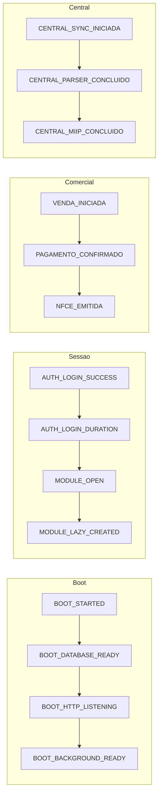
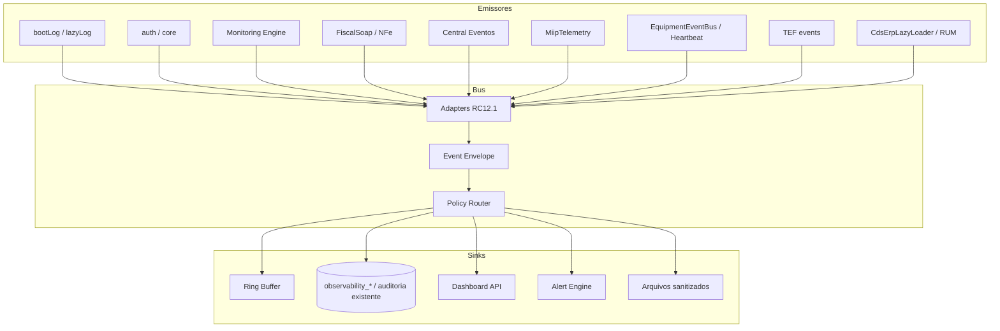
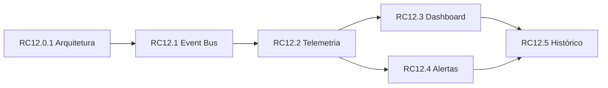
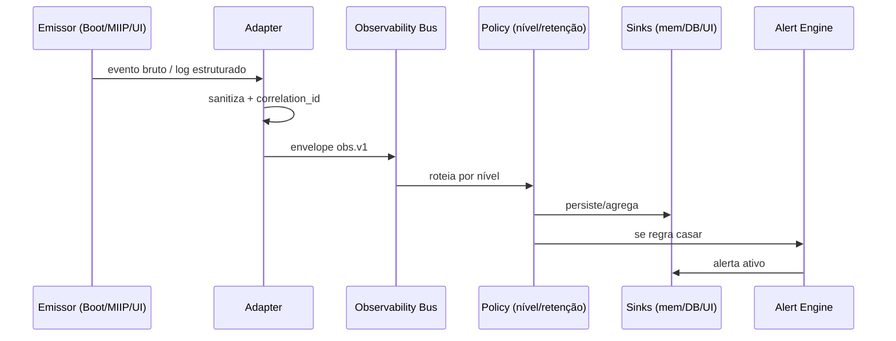

# ARQUITETURA DE OBSERVABILIDADE CDS — RC12.0.1

**Documento:** `docs/oficial/observabilidade/ARQUITETURA_OBSERVABILIDADE_RC12.md`  
**Sprint:** RC12.0.1 (READ-ONLY)  
**Status:** **ARQUITETURA OFICIAL** da série RC12.x  
**Data:** 2026-07-26  
**Confidence:** 1.00  

**Garantias desta sprint:** nenhum código, banco, API, Electron, `package.json`, regra de negócio ou motor foi alterado. Somente este documento.

**Bases empíricas:**

- `docs/oficial/performance/BOOT_INTELIGENTE_RC11_1.md`
- `docs/oficial/performance/RELATORIO_RC11_2_BOOT_NAO_BLOQUEANTE.md`
- `docs/oficial/performance/RELATORIO_RC11_3_LAZY_SERVICES.md`
- `docs/oficial/performance/RELATORIO_RC11_4_LAZY_ERP.md`
- `docs/oficial/performance/RELATORIO_RC11_5_LAZY_MIIP.md`
- Inventário vivo de `backend/monitoring/*`, `backend/services/auditoria.js`, telemetrias fiscal/TEF/MIIP/equipamentos e painéis ERP/PDV

---

## 1. Resumo executivo

### Problema

A observabilidade do CDS Sistemas é **policêntrica**. Existem muitos pontos de emissão (console JSON, auditoria SQLite, Monitoring Engine, Heartbeat, telemetria SOAP, TEF, MIIP, Central, EquipmentEventBus, Lazy Loader frontend), porém:

1. **Não há um barramento único** de eventos de plataforma.
2. **Métricas de UX/performance** (login, abertura de módulo, lazy load) ficam em console/memória e **não têm sink oficial**.
3. Painéis operacionais (Monitoring, Central Diagnóstico, NF-e, TEF, Equipamentos) são ricos, mas **não formam um dashboard de observabilidade unificado**.
4. Alertas existem por domínio (Central, Heartbeat, TEF, Monitoring Intelligence), porém **sem política comum de criticidade/retenção**.

### Objetivo da Observabilidade V1

Projetar a arquitetura oficial para **monitorar, diagnosticar e medir** o CDS em produção **sem alterar regras de negócio**:

- Unificar eventos críticos sob um **Event Bus interno** (CDS Observability Bus).
- Definir contrato de telemetria (nome, categoria, origem, payload, nível, criticidade, retenção).
- Projetar um **Dashboard de Observabilidade** (boot, login, módulos, fiscal, MIIP, lazy, background, fila, recursos).
- Definir **regras de alerta** e um **roadmap RC12.1–RC12.5**.

### Princípios (imutáveis)

| Princípio | Significado |
|-----------|-------------|
| P1 — Read-only nesta RC | RC12.0.1 não altera runtime |
| P2 — Sem mudança de contrato de negócio | APIs de venda/fiscal/estoque/caixa permanecem idênticas |
| P3 — Fail-closed em dados sensíveis | Telemetria nunca inclui CSC, senha PFX, token TEF, XML completo sem sanitização |
| P4 — Domínios existentes são fontes | Não reinventar Monitoring Engine / Heartbeat / Central Diagnóstico — **adaptá-los** |
| P5 — Opt-in por severidade | DEBUG/INFO locais; WARN/ERROR/CRITICAL com retenção e alerta |
| P6 — Medir antes de otimizar | Toda RC de execução publica deltas de latência/erro |

### Veredito as-is

| Camada | Estado atual | Lacuna principal |
|--------|--------------|------------------|
| Console estruturado (BOOT/LAZY/FISCAL/CENTRAL/MIP) | Forte | Efêmero; sem agregação |
| Auditoria de negócio (`auditoria`) | Forte | Não cobre performance/RUM |
| Monitoring Engine ERP | Forte (KPIs/COP) | Não é APM; TefProvider parcial |
| Diagnósticos (Central/NF-e/TEF/Equipamentos) | Forte | Fragmentados |
| Telemetria SOAP / MIIP / Heartbeat | Média–Forte | Ring buffers; flush MIIP parcial |
| UX Frontend (login, módulo, lazy) | Fraca | Só console/RAM |

---

## 2. Fase 1 — Inventário (mapa as-is)

### 2.1 Por módulo

| Módulo | Emissores principais | Persistência | Consumidor UI/API |
|--------|----------------------|--------------|-------------------|
| **Boot / Server** | `bootLog` em `backend/server.js` (`BOOT`, `DATABASE READY`, `HTTP LISTENING`, `BACKGROUND *`) | Console JSON | Ops / processo |
| **Lazy Backend** | `lazyLog` em `backend/boot/lazyService.js` (`LAZY INIT/CREATED/REUSED/ERROR`) | Console JSON | Ops; serviços miip/auditoria/lab/backup |
| **Auditoria ERP** | `gravarAuditoria` (`backend/services/auditoria.js`) | SQLite `auditoria` | `/api/auditoria`, tela Auditoria |
| **Monitoring Engine** | `MonitoringEngine` + providers + intelligence + action center | Sob demanda (cache desabilitado M1–M4) | `/api/monitoring/summary`, `cds-monitoring-engine.js` |
| **Fiscal SOAP** | `FiscalSoapTelemetry`, `FiscalRuntimeLog` | Memória (ring) + console | Diagnóstico Central; ops |
| **NF-e** | `nfeTrace`, `nfeOperacionalService`, `nfeXmlAuditoria` | Arquivo `logs/nfe/trace/*` + `nfe_operacional_logs` | `/api/nfe/monitor\|fila\|diagnostico\|logs` |
| **Central Entradas** | `centralLog`, `centralOperacaoLog`, `centralEventosEmitter`, notificações, diagnóstico, sync background | `central_entradas_eventos`, `central_entradas_notificacoes` + console | `/api/central-entradas/*`, `central-diagnostico.js` |
| **MIIP** | `MiipTelemetryService`, `MiipMetricsCollector`, `MiipMonitoringService`, `MiipAuditService`, `/api/miip/health` | Memória + parcial `miip_*` | Health API; Central/Compras |
| **MIP** | `mipLogger` | Console | Ops |
| **Equipamentos** | `MonitorService`, `HeartbeatEngine`, `LoggerService`, `AlertChannel` | `equipamentos_logs`, `equipamentos_heartbeat*` | `/api/monitoramento-equipamentos/*` |
| **Integração Equipamentos** | `EquipmentEventBus`, `EquipamentosAuditoria` | Ring 500 + `equipamentos_integracao_auditoria` | `/api/integracao-equipamentos/*` |
| **TEF** | `tefMonitoringService`, `tefMonitorService`, `tefDiagnosticoService`, `tefLogRetentionService` | `tef_logs`, alertas, auditoria acesso | `/api/tef/monitor-status`, `/diagnostico*` |
| **Plataforma** | `plataformaStatusService` | Não (snapshot) | `/api/plataforma/status`, barra ERP |
| **Licença** | `licencaService` | `licenca_logs`, `licenca_historico` | Assinatura / status |
| **ERP Lazy Loader** | `CdsErpLazyLoader` (`[ERP LAZY]`) | Console + Map RAM | DevTools; `getPageStats` |
| **PDV** | `[PDV AUDIT EQUIPAMENTOS]` | Buffer `window.__PDV_AUDIT_EQUIPAMENTOS` | Console local |
| **Dashboard Command** | KPIs via `/api/dashboard/resumo` | Leitura | `dashboard-command.js` (saúde MIIP/Central/Fiscal ainda placeholder) |

### 2.2 Tabelas de observabilidade / trilha

| Tabela | Papel |
|--------|-------|
| `auditoria` | Trilha genérica de ações humanas/sistema |
| `auditoria_caixa` / `auditoria_alertas` | Caixa e alertas persistentes |
| `auditoria_pedido_estoque_fiscal` | Reserva/estoque fiscal de pedidos |
| `nfe_operacional_logs` | Fila/monitor NF-e |
| `central_entradas_eventos` / `central_entradas_notificacoes` | Timeline e inbox da Central |
| `miip_decisoes` / `miip_estatisticas` / … | Decisões e métricas MIIP |
| `equipamentos_logs` / `equipamentos_eventos` / `equipamentos_heartbeat*` | Motor + heartbeat |
| `equipamentos_integracao_auditoria` | Integração RC5 |
| `tef_logs` / `tef_auditoria_acesso` / `tef_alertas_*` / `tef_notificacoes_falha` | TEF |
| `licenca_logs` | Licenciamento |

### 2.3 Classificação de maturidade

| Tipo | Exemplos | Maturidade |
|------|----------|------------|
| **A — Produção operacional** | Auditoria, NF-e operacional, Central eventos, Heartbeat, TEF logs | Alta |
| **B — Painel analítico** | Monitoring Engine, Central Diagnóstico, TEF diagnóstico | Alta–Média |
| **C — Telemetria técnica** | FiscalSoapTelemetry, MiipTelemetry, boot/lazy JSON | Média |
| **D — Dev-only / local** | ERP LAZY console, PDV audit buffer, nfeTrace arquivo | Baixa (sem sink) |

---

## 3. Fase 2 — Mapa de eventos críticos

### 3.1 Catálogo oficial (alvo RC12)

Convenção de nome: `dominio.objeto.acao` (snake case interno opcional; **event name** estável em UPPER_SNAKE para bus).

| Event Name | Categoria | Origem típica | Criticidade | Existe hoje? |
|------------|-----------|---------------|-------------|--------------|
| `BOOT_STARTED` | platform | server | INFO | Parcial (`BOOT`) |
| `BOOT_DATABASE_READY` | platform | database | INFO | Sim |
| `BOOT_HTTP_LISTENING` | platform | server | INFO | Sim |
| `BOOT_BACKGROUND_STEP` | platform | Grupo B | INFO/ERROR | Sim |
| `BOOT_BACKGROUND_READY` | platform | Grupo B | INFO | Sim |
| `LAZY_SERVICE_CREATED` | platform | lazyService | INFO | Sim |
| `LAZY_SERVICE_REUSED` | platform | lazyService | DEBUG | Sim |
| `LAZY_SERVICE_ERROR` | platform | lazyService | ERROR | Sim |
| `AUTH_LOGIN_SUCCESS` | security | auth | INFO | Parcial (auditoria) |
| `AUTH_LOGIN_FAILURE` | security | auth | WARN | Parcial |
| `AUTH_LOGOUT` | security | auth/core | INFO | Lacuna UX timing |
| `AUTH_LOGIN_DURATION` | performance | frontend+auth | INFO | **Lacuna** |
| `MODULE_OPEN` | ux | erp `loadPage` | INFO | **Lacuna** |
| `MODULE_LAZY_CREATED` | performance | CdsErpLazyLoader | INFO | Local only |
| `MODULE_LAZY_REUSED` | performance | CdsErpLazyLoader | DEBUG | Local only |
| `MODULE_LAZY_ERROR` | performance | CdsErpLazyLoader | ERROR | Local only |
| `VENDA_INICIADA` | comercial | PDV/ERP | INFO | Parcial |
| `VENDA_FINALIZADA` | comercial | Venda* | INFO | Parcial (auditoria) |
| `VENDA_CANCELADA` | comercial | cancelamento | WARN | Sim (auditoria) |
| `PAGAMENTO_INICIADO` | pagamento | Orquestrador/MIDP | INFO | Parcial |
| `PAGAMENTO_CONFIRMADO` | pagamento | Orquestrador/TEF | INFO | Parcial |
| `PAGAMENTO_FALHOU` | pagamento | TEF/caixa | ERROR | Sim (TEF) |
| `RESERVA_CRIADA` | estoque | reservas | INFO | Parcial |
| `RESERVA_LIBERADA` | estoque | reservas | INFO | Parcial |
| `NFCE_EMITIDA` | fiscal | emissor NFC-e | INFO | Parcial |
| `NFCE_REJEITADA` | fiscal | emissor | WARN | Parcial |
| `NFCE_CANCELADA` | fiscal | cancelamento | WARN | Parcial |
| `NFE_EMITIDA` | fiscal | nfeEmissor/Central Fat. | INFO | Parcial |
| `NFE_AGUARDANDO_RETORNO` | fiscal | nfe operacional | INFO | Sim (fila) |
| `NFE_AUTORIZADA` | fiscal | nfe operacional | INFO | Sim |
| `NFE_REJEITADA` | fiscal | nfe operacional | WARN | Sim |
| `NFE_ERRO_COMUNICACAO` | fiscal | SOAP | ERROR | Sim |
| `SOAP_INICIADO` | fiscal | FiscalSoapTelemetry | DEBUG | Sim |
| `SOAP_FINALIZADO` | fiscal | FiscalSoapTelemetry | INFO | Sim |
| `SOAP_TIMEOUT` | fiscal | FiscalSoapTelemetry | ERROR | Sim |
| `SOAP_CSTAT` | fiscal | FiscalSoapTelemetry | INFO/WARN | Sim |
| `CENTRAL_SYNC_INICIADA` | central | TIPOS_EVENTO | INFO | Sim |
| `CENTRAL_SYNC_CONCLUIDA` | central | TIPOS_EVENTO | INFO | Sim |
| `CENTRAL_SYNC_ERRO` | central | TIPOS_EVENTO | ERROR | Sim |
| `CENTRAL_DOCUMENTO_RECEBIDO` | central | TIPOS_EVENTO | INFO | Sim |
| `CENTRAL_PARSER_CONCLUIDO` | central | TIPOS_EVENTO | INFO | Sim |
| `CENTRAL_MIIP_CONCLUIDO` | central | TIPOS_EVENTO | INFO | Sim |
| `CENTRAL_UPLOAD_XML` | central | upload | INFO | Parcial |
| `CENTRAL_BACKGROUND_SLEEP` | central | sync bg | INFO | Sim (log) |
| `MIIP_IDENTIFY_STARTED` | miip | MiipTelemetry | DEBUG | Parcial |
| `MIIP_IDENTIFY_FINISHED` | miip | MiipTelemetry | INFO | Parcial |
| `MIIP_SLOW` | miip | telemetria | WARN | **Alvo** |
| `MIIP_HEALTH_DEGRADED` | miip | healthCheck | WARN | Parcial |
| `EQUIPMENT_ONLINE` | equipamentos | EquipmentEventBus | INFO | Sim |
| `EQUIPMENT_OFFLINE` | equipamentos | EquipmentEventBus | WARN | Sim |
| `HEARTBEAT_FAILED` | equipamentos | Heartbeat/AlertChannel | ERROR | Sim |
| `EQUIPMENT_SYNC_FINISHED` | equipamentos | EventBus | INFO | Sim |
| `TEF_TRANSACTION_OK` | tef | tefEvents | INFO | Parcial |
| `TEF_TRANSACTION_ERROR` | tef | tefEvents | ERROR | Sim |
| `TEF_PINPAD_OFFLINE` | tef | monitor | WARN | Parcial |
| `SCHEDULER_TICK` | platform | cron/xml-wait | DEBUG | Parcial |
| `BACKGROUND_ERROR` | platform | Grupo B | ERROR | Sim |
| `ERROR_UNHANDLED` | platform | Express/process | CRITICAL | Parcial |
| `TIMEOUT_HTTP` | platform | soap/fetch | ERROR | Parcial |
| `QUEUE_DEPTH_HIGH` | fiscal/ops | nfe fila | WARN | **Alvo** |
| `RESOURCE_MEMORY_HIGH` | platform | process | WARN | **Lacuna** |
| `RESOURCE_CPU_HIGH` | platform | process | WARN | **Lacuna** |

### 3.2 Eventos críticos por jornada



---

## 4. Fase 3 — Telemetria (barramento interno)

### 4.1 CDS Observability Bus (alvo)

Componente lógico **não invasivo**: adapters emitem para um bus interno; sinks consomem.



### 4.2 Envelope oficial do evento

| Campo | Tipo | Obrigatório | Descrição |
|-------|------|-------------|-----------|
| `event_name` | string | Sim | Catálogo §3.1 |
| `categoria` | enum | Sim | `platform` \| `security` \| `ux` \| `performance` \| `comercial` \| `pagamento` \| `estoque` \| `fiscal` \| `central` \| `miip` \| `equipamentos` \| `tef` |
| `origem` | string | Sim | Módulo/arquivo lógico (`server`, `erp.lazy`, `central.sync`, …) |
| `nivel` | enum | Sim | `DEBUG` \| `INFO` \| `WARN` \| `ERROR` \| `CRITICAL` |
| `criticidade` | enum | Sim | `baixa` \| `media` \| `alta` \| `critica` |
| `ts` | ISO-8601 | Sim | Instantâneo UTC |
| `correlation_id` | string | Recomendado | Liga SOAP/Central/NFe/TEF |
| `request_id` | string | Opcional | HTTP/request |
| `usuario_id` | number\|null | Opcional | Sem PII excessivo |
| `terminal_id` | string\|null | Opcional | PDV/caixa |
| `duracao_ms` | number\|null | Condicional | Latências |
| `resultado` | enum | Condicional | `ok` \| `erro` \| `timeout` \| `parcial` |
| `payload` | object | Sim | Dados **sanitizados** |
| `versao_schema` | string | Sim | Ex.: `obs.v1` |
| `retencao_dias` | number | Sim | Política §4.4 |

### 4.3 Payload — regras de sanitização

**Permitido:** IDs, status, cStat, tempos, contagens, nomes de motor, códigos de erro genéricos, tamanhos.  
**Proibido:** senha certificado, CSC/token, PAN/TEF sensível, XML completo sem redaction, JWT, conteúdo de auditoria com dados pessoais além do mínimo.

### 4.4 Retenção sugerida

| Nível / Tipo | Retenção | Sink preferencial |
|--------------|----------|-------------------|
| DEBUG | 1–3 dias (ou só memória) | Ring buffer |
| INFO performance/UX | 15–30 dias | Tabela agregada + samples |
| INFO negócio / Central / NFe | 90–180 dias | Já coberto por trilhas atuais |
| WARN | 90 dias | DB + alertas |
| ERROR | 180–365 dias | DB + alertas |
| CRITICAL | 365+ dias | DB + notificação imediata |
| TEF logs | Conforme `tefLogRetentionService` (hoje ~90/180/365 via env) | Manter política TEF |
| nfeTrace arquivo | Rotação operacional (definir RC12.5) | Filesystem |

### 4.5 Relação com componentes existentes (não substituir)

| Existente | Papel no RC12 |
|-----------|---------------|
| `EquipmentEventBus` | Adapter → envelope `equipamentos.*` |
| `centralEventosEmitter` | Adapter → envelope `central.*` |
| `FiscalSoapTelemetry` | Adapter → envelope `SOAP_*` / métricas |
| `MiipTelemetryService` | Adapter → envelope `MIIP_*` + flush `miip_estatisticas` |
| `MonitoringEngine` | Continua como **fonte de KPIs**; também consome health do bus |
| `gravarAuditoria` | Continua como **trilha humana**; eventos de performance **não** misturam payload sensível |
| `CdsErpLazyLoader` | Adapter frontend → POST batch opcional (RC12.2) |

---

## 5. Fase 4 — Dashboard de Observabilidade

### 5.1 Visão do painel (alvo)

Novo painel ERP sugerido: **Observabilidade** (Administração / SUPER_ADMIN), **separado** do Monitoring Engine comercial (COP).

| Bloco | Métricas | Fonte as-is / alvo |
|-------|----------|--------------------|
| **Boot** | Tempo até `HTTP LISTENING`; tempo `BACKGROUND READY`; falhas de step | `bootLog` → bus |
| **Login** | p50/p95 `AUTH_LOGIN_DURATION`; taxa falha | Frontend + auth (RC12.2) |
| **Módulos ERP** | Tempo 1ª carga vs reuse; erros lazy; top páginas lentas | `CdsErpLazyLoader` |
| **NFC-e** | Tempo emissão; rejeições; erros comunicação | emissor + auditoria fiscal |
| **NF-e** | Tempo autorização; profundidade da fila; estados monitor | `nfe_operacional_*` |
| **MIIP** | Tempo médio identificação; engines com erro; health | MiipTelemetry / health |
| **Lazy Backend** | Serviços criados/reutilizados; createdMs | lazyService |
| **Background** | Status Grupo B; Central sync sleep/erro; NFe retoma | boot + CentralSync + nfe |
| **Filas** | NF-e fila; heartbeat fila; TEF pendências | APIs existentes |
| **Recursos** | Heap RSS; CPU opcional (Node `process`) | **Novo** sampler RC12.2 |
| **Alertas ativos** | Lista consolidada | Alert Engine RC12.4 |

### 5.2 Wireframe lógico

```text
┌─────────────────────────────────────────────────────────────┐
│ OBSERVABILIDADE CDS                    [periodo] [atualizar]│
├───────────────┬───────────────┬───────────────┬─────────────┤
│ Boot p95      │ Login p95     │ Módulo p95    │ Alertas     │
│  ___ ms       │  ___ ms       │  ___ ms       │  N críticos │
├───────────────┴───────────────┴───────────────┴─────────────┤
│ Timeline: BOOT → LOGIN → MODULE → FISCAL/MIIP/TEF           │
├─────────────────────────────┬───────────────────────────────┤
│ NF-e fila / monitor         │ Central sync / SEFAZ          │
├─────────────────────────────┼───────────────────────────────┤
│ MIIP latency / health       │ Equipamentos online/offline   │
├─────────────────────────────┴───────────────────────────────┤
│ Lazy ERP: created vs reused | Background steps              │
│ Memória / CPU (sparkline)                                   │
└─────────────────────────────────────────────────────────────┘
```

### 5.3 Relação com Monitoring Engine

| Painel | Pergunta que responde |
|--------|------------------------|
| **Monitoring Engine (COP)** | “Como está o **negócio** hoje?” (vendas, receber, caixa, alertas comerciais) |
| **Observabilidade (RC12)** | “Como está a **plataforma**?” (latência, erros, filas, boot, lazy, saúde técnica) |

Ambos podem coexistir; Action Center do Monitoring já aponta para `central-diagnostico` — RC12 pode acrescentar deep-links para Observabilidade.

---

## 6. Fase 5 — Alertas

### 6.1 Motor de alertas (alvo)

- Entrada: eventos do bus + agregações (janela deslizante).
- Saída: registro persistente + notificação (inicialmente LOG/UI; canais externos reutilizam stubs do `AlertChannel` quando maduros).
- Deduplicação por `event_name` + fingerprint + janela.

### 6.2 Regras iniciais

| Regra | Condição sugerida | Criticidade | Ação |
|-------|-------------------|-------------|------|
| Boot lento | `BOOT_HTTP_LISTENING.ms > 5000` | alta | Alerta + log |
| Background falhou | `BOOT_BACKGROUND_STEP` resultado erro | alta | Alerta + painel |
| MIIP lento | `MIIP_IDENTIFY_FINISHED.duracao_ms` p95 > 2000 (janela 15 min) | media | Alerta |
| Central parada | Sem `CENTRAL_SYNC_*` com sucesso em X min **e** sync automática esperada | alta | Alerta + deep-link diagnóstico |
| Equipamento offline | `EQUIPMENT_OFFLINE` / `HEARTBEAT_FAILED` persistente > N ciclos | alta | Alerta + Central Equipamentos |
| NF-e pendente | Contagem `aguardando_retorno` ou `pendente_reenvio` > limiar | media/alta | Alerta + Monitor NF-e |
| Fila crescendo | Taxa de crescimento da fila NF-e > limiar / 10 min | alta | Alerta |
| SOAP timeout | `SOAP_TIMEOUT` ≥ N em 5 min | alta | Alerta |
| TEF pinpad offline | Status monitor offline | alta | Alerta + Diagnóstico TEF |
| Lazy module error | `MODULE_LAZY_ERROR` | media | Alerta |
| Memória alta | Heap > limiar configurável | media | Alerta |
| Login falhas | Taxa `AUTH_LOGIN_FAILURE` anômala | alta | Alerta segurança |

Limiares exatos devem ser calibrados em RC12.4 com dados reais (sem hardcode cego nesta arquitetura).

### 6.3 Severidade × resposta

| Criticidade | UI | Persistência | Notificação externa |
|-------------|----|--------------|---------------------|
| baixa | Badge informativo | 15–30 dias | Não |
| media | Lista alertas | 90 dias | Opcional |
| alta | Banner + Action Center | 180 dias | Quando canal habilitado |
| critica | Banner bloqueante ops | 365+ dias | Sim (quando existir) |

---

## 7. Fase 6 — Roadmap RC12.x

| RC | Nome | Objetivo | Altera código? | Critério de saída |
|----|------|----------|----------------|-------------------|
| **RC12.0.1** | Arquitetura (este doc) | Inventário + contrato + roadmap | **Não** | Doc oficial confidence 1.00 |
| **RC12.1** | Event Bus | Envelope `obs.v1`, bus in-process, adapters BOOT/LAZY/Central/Equipment/SOAP | Sim (infra, sem regra negócio) | Eventos fluem; testes de contrato |
| **RC12.2** | Telemetria | Sampler memória/CPU; adapters MIIP/TEF/NFe fila; RUM mínimo (login/módulo/lazy) com batch opt-in | Sim | Métricas no sink; sanitização validada |
| **RC12.3** | Dashboard | Painel Observabilidade + API read-only agregada | Sim (UI/API obs) | KPIs §5.1 visíveis |
| **RC12.4** | Alertas | Motor de regras + dedupe + UI alertas | Sim | Regras §6.2 operacionais |
| **RC12.5** | Histórico | Retenção, agregados diários, exportação, rotação arquivos | Sim | Políticas §4.4 aplicadas |

### Ordem de dependência



### Fora de escopo explícito (série RC12)

- APM SaaS externo obrigatório (Datadog/New Relic) — opcional via sink futuro.
- Alterar Decision/Explain/Canonical engines do MIIP.
- Alterar regras fiscais, TEF de autorização ou schema de venda.
- Substituir Monitoring Engine comercial.

---

## 8. Modelo de logs (unificado)

### 8.1 Canais

| Canal | Formato | Uso |
|-------|---------|-----|
| **Console JSON** | `{ tag, evento, ms, … }` | Ops imediato (já BOOT/LAZY) |
| **Trilha auditoria** | Linha `auditoria` | Compliance / “quem fez o quê” |
| **Event Bus** | Envelope `obs.v1` | Observabilidade técnica |
| **Arquivo sanitizado** | Trace NF-e / diagnóstico XML | Deep dive fiscal |
| **Painel** | Aggregates | Operação diária |

### 8.2 Tags console existentes a preservar

| Tag | Origem |
|-----|--------|
| `BOOT` | `server.js` |
| `LAZY` | `lazyService.js` |
| `[ERP LAZY]` | `frontend/erp/js/app.js` |
| `[Central Entradas]` | `centralLog` |
| `[FISCAL:…]` | FiscalRuntimeLog / SOAP |
| `[TRACE][NFE]` | nfeTrace |
| `[MIP]` | mipLogger |
| `[Equipamentos]` | LoggerService |
| `[TEF MONITORING]` | tefMonitoringService |

RC12.1 deve **adaptar**, não apagar, essas tags.

---

## 9. Fluxo de telemetria (to-be)



---

## 10. Checklist de sucesso (RC12.0.1)

| Critério | Status |
|----------|--------|
| Inventário de logs/auditorias/monitoramento/métricas/diagnósticos | ✓ |
| Classificação por módulo | ✓ |
| Mapa de eventos críticos (boot→erro/timeout) | ✓ |
| Projeto de barramento (envelope, categoria, retenção) | ✓ |
| Projeto de dashboard de observabilidade | ✓ |
| Regras de alerta iniciais | ✓ |
| Roadmap RC12.1–RC12.5 | ✓ |
| Nenhum código/banco/API/Electron/`package.json` alterado | ✓ |
| Confidence ≥ 1.00 | ✓ |

---

## 11. Checklist de implementação futura (RC12.1+)

- [ ] Criar módulo `backend/observabilidade/` (bus + envelope + policy) sem acoplar regras de venda/fiscal.
- [ ] Adapter `bootLog` / `lazyLog` → bus.
- [ ] Adapter `EquipmentEventBus` / `centralEventosEmitter` / `FiscalSoapTelemetry`.
- [ ] Adapter frontend: batch opcional `MODULE_*` + `AUTH_LOGIN_DURATION`.
- [ ] API read-only `/api/observabilidade/summary` (nome sugerido; não conflitar com `/api/monitoring`).
- [ ] Painel ERP Observabilidade (lazy Grupo B).
- [ ] Alert Engine com limiares calibrados.
- [ ] Testes de contrato: sanitização, retenção, dedupe.
- [ ] Documentar limiares reais pós-calibração em relatório RC12.4.

---

## 12. Riscos e mitigações

| Risco | Mitigação |
|-------|-----------|
| Volume excessivo de eventos | Sampling DEBUG; agregação; ring buffer |
| Vazamento de segredo em payload | Sanitizer obrigatório + testes |
| Duplicar Monitoring Engine | Separar COP (negócio) × Observabilidade (plataforma) |
| Impacto no boot | Adapters pós-listen; nunca bloquear `HTTP LISTENING` |
| Contaminação de regras fiscais | Adapters só observam; não alteram fluxo SEFAZ |

---

## 13. Conclusão

O CDS já possui **fundamentos sólidos** de observabilidade operacional (auditoria, Monitoring Engine, Central Diagnóstico, NF-e operacional, Heartbeat, TEF, telemetria SOAP/MIIP). A série **RC12** deve **unificar** esses sinais sob um contrato único (`obs.v1`), preencher as lacunas de **RUM/UX** (login, módulos, lazy) e entregar um **dashboard + alertas** de plataforma — sem alterar regras de negócio.

Esta RC12.0.1 congela a arquitetura oficial. A execução começa em **RC12.1 — Event Bus**.

---

*Fim de `ARQUITETURA_OBSERVABILIDADE_RC12.md`*
