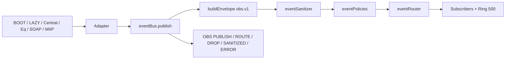

# RELATÓRIO RC12.1 — CDS OBSERVABILITY BUS

**Data:** 2026-07-26  
**Arquitetura:** `docs/oficial/observabilidade/ARQUITETURA_OBSERVABILIDADE_RC12.md`  
**Status:** Implementação controlada  
**Confidence:** 1.00  

---

## 1. Resumo executivo

Implementado o **CDS Observability Bus** (`backend/observabilidade/`), barramento interno **observe-only** com envelope **`obs.v1`**, sanitização fail-closed, políticas de retenção e adapters para BOOT, LAZY, Central, Equipamentos, Fiscal SOAP e MIIP Telemetry.

- `publish()` / `publishAsync()` **nunca bloqueiam** a aplicação (`setImmediate`).
- Nenhum contrato público de API, banco, Electron, `package.json`, Monitoring Engine ou regra de negócio foi alterado.
- Motores fiscais / Decision-Explain-Canonical do MIIP **não foram modificados** (adapters via subscribe ou monkey-patch de telemetria/utilitários).

---

## 2. Arquitetura implementada

```text
backend/observabilidade/
  index.js                 Fachada pública + iniciar()
  eventBus.js              publish / subscribe / ring
  eventEnvelope.js         Contrato obs.v1 + validação
  eventRouter.js           Entrega a subscribers + ring buffer
  eventPolicies.js         Nível / criticidade / retenção
  eventSanitizer.js        Redaction CSC/senha/token/JWT/PAN/XML
  eventTypes.js            Enums + EVENT_NAMES
  adapters/
    index.js               iniciarAdapters()
    bootAdapter.js
    lazyAdapter.js
    centralAdapter.js
    equipmentAdapter.js
    fiscalSoapAdapter.js
    miipAdapter.js
```

### Fluxograma



---

## 3. Envelope `obs.v1`

Campos obrigatórios validados:

| Campo | Notas |
|-------|-------|
| `event_name` | Catálogo `EVENT_NAMES` |
| `categoria` | platform, fiscal, central, miip, equipamentos, … |
| `origem` | Emissores lógicos |
| `nivel` | DEBUG/INFO/WARN/ERROR/CRITICAL |
| `criticidade` | baixa/media/alta/critica |
| `timestamp` | ISO-8601 |
| `payload` | Objeto sanitizado |
| `versao_schema` | Sempre `obs.v1` |
| `retencao_dias` | Por política de nível |

Opcionais: `correlation_id`, `request_id`, `usuario_id`, `terminal_id`, `duracao_ms`, `resultado`.

---

## 4. Eventos suportados (adapters RC12.1)

| Domínio | Eventos |
|---------|---------|
| **Boot** | `BOOT_STARTED`, `BOOT_DATABASE_READY/ERROR`, `BOOT_HTTP_LISTENING`, `BOOT_BACKGROUND_*`, `BOOT_MIP_FLAG_READY` |
| **Lazy** | `LAZY_SERVICE_INIT/CREATED/REUSED/ERROR` |
| **Central** | `CENTRAL_EVENT`, `CENTRAL_SYNC_*`, `CENTRAL_PARSER_CONCLUIDO`, `CENTRAL_MIIP_CONCLUIDO`, `CENTRAL_DOCUMENTO_RECEBIDO`, `CENTRAL_ERRO` |
| **Equipamentos** | `EQUIPMENT_*`, `HEARTBEAT_FAILED` |
| **SOAP** | `SOAP_INICIADO/FINALIZADO/FALHA/TIMEOUT/HTTP_ERROR/CSTAT` |
| **MIIP** | `MIIP_IDENTIFY_FINISHED`, `MIIP_HEALTH_DEGRADED` |

---

## 5. Adapters implementados

| Adapter | Estratégia | Altera motor? |
|---------|------------|---------------|
| BOOT | Hook em `bootLog` (`server.js`) → `publishBootEvent` | Não (só emit obs) |
| LAZY | Hook em `lazyLog` (`lazyService.js`) → `publishLazyEvent` | Não |
| Central | Monkey-patch de `emitirEvento` (retorno preservado) | Não (utilitário) |
| Equipment | `EquipmentEventBus.on('*')` | Não |
| Fiscal SOAP | `fiscalSoapTelemetry.on(evento)` | Não (subscribe) |
| MIIP | Patch de `MiipTelemetryService.prototype.finalizarExecucao` | Não (telemetria only) |

Inicialização: `require('./observabilidade').iniciar()` no `setImmediate` pós-`listen` (antes do Grupo B), fail-safe.

---

## 6. Políticas

| Nível | Retenção (dias) |
|-------|----------------:|
| DEBUG | 3 |
| INFO | 30 |
| WARN | 90 |
| ERROR | 180 |
| CRITICAL | 365 |

Defaults por `event_name` em `EVENT_DEFAULTS` (ex.: `SOAP_TIMEOUT` → ERROR/alta).

Sink RC12.1: **memória** (ring 500) + console estruturado. Persistência DB fica para RC12.2/12.5.

---

## 7. Sanitização

Removido / redacted automaticamente:

- Chaves: `csc`, `senha`, `password`, `token`, `jwt`, `pan`, `fiscal_certificado_senha`, …
- Valores JWT (`eyJ…`)
- Strings com aparência de XML / SOAP / NFe
- Padrões tipo PAN (13–19 dígitos)

Logs: `OBS SANITIZED` quando houver redaction.

---

## 8. Logs estruturados

| Evento OBS | Quando |
|------------|--------|
| `OBS PUBLISH` | Envelope aceito |
| `OBS ROUTE` | Entregue ao router/subscribers |
| `OBS DROP` | Validação/policy/disabled |
| `OBS SANITIZED` | Payload redacted |
| `OBS ERROR` | Falha isolada no pipeline/subscriber |

---

## 9. Compatibilidade

| Item | Status |
|------|--------|
| Regras de negócio | Inalteradas |
| APIs públicas | Inalteradas |
| Banco / schema | Sem mudanças |
| Electron / package.json | Inalterados |
| Monitoring Engine | Não tocado |
| Decision/Explain/Canonical MIIP | Não tocados |
| Fluxo SOAP / venda / TEF | Inalterado |

---

## 10. Resultados dos testes

| Suíte | Resultado |
|-------|-----------|
| `tests/rc12-1-observability-bus.test.js` | **OK** (contracts + sanitização + adapters) |
| `test:miip-readiness` | 42/42 |
| `test:central-entradas-sprint5` | 7/7 (OBS PUBLISH observado em lazy MIIP) |
| `test:nfe-parser` | 6/6 |
| `test:fiscal-qrcode` | 9/9 |
| `test:tef-fluxo` | 13/13 |
| `test:rc3165-electron` | OK |

---

## 11. Checklist de sucesso

| Critério | Status |
|----------|--------|
| Event Bus funcional | ✓ |
| Adapters ativos | ✓ |
| Nenhuma regra de negócio alterada | ✓ |
| Nenhuma API alterada | ✓ |
| Schema obs.v1 validado | ✓ |
| Sanitização com testes | ✓ |
| publish não-bloqueante | ✓ |
| Testes aprovados | ✓ |
| Confidence ≥ 1.00 | ✓ |

---

## 12. Arquivos

| Arquivo | Ação |
|---------|------|
| `backend/observabilidade/**` | **Criado** |
| `backend/server.js` | Hook BOOT + `iniciar()` pós-listen |
| `backend/boot/lazyService.js` | Hook LAZY |
| `tests/rc12-1-observability-bus.test.js` | **Criado** |
| `docs/oficial/observabilidade/RELATORIO_RC12_1_EVENT_BUS.md` | Este relatório |

*Próximo:* RC12.2 — Telemetria (RUM login/módulo, sampler recursos, flush agregado).

*Fim do RELATORIO_RC12_1_EVENT_BUS.md*
