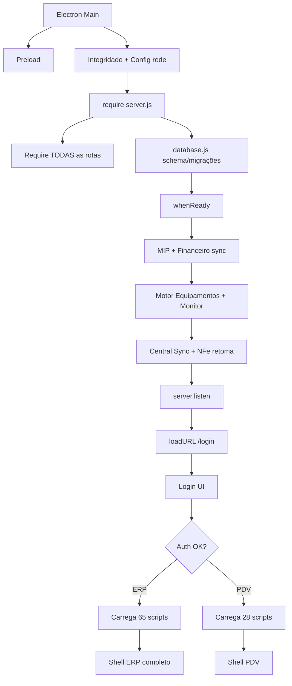
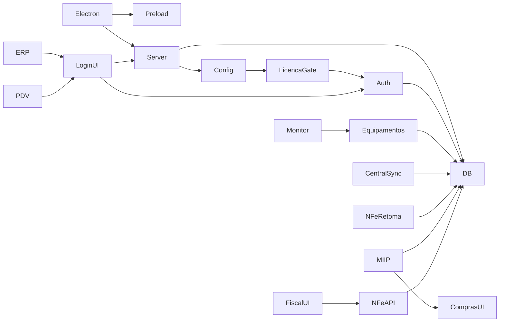
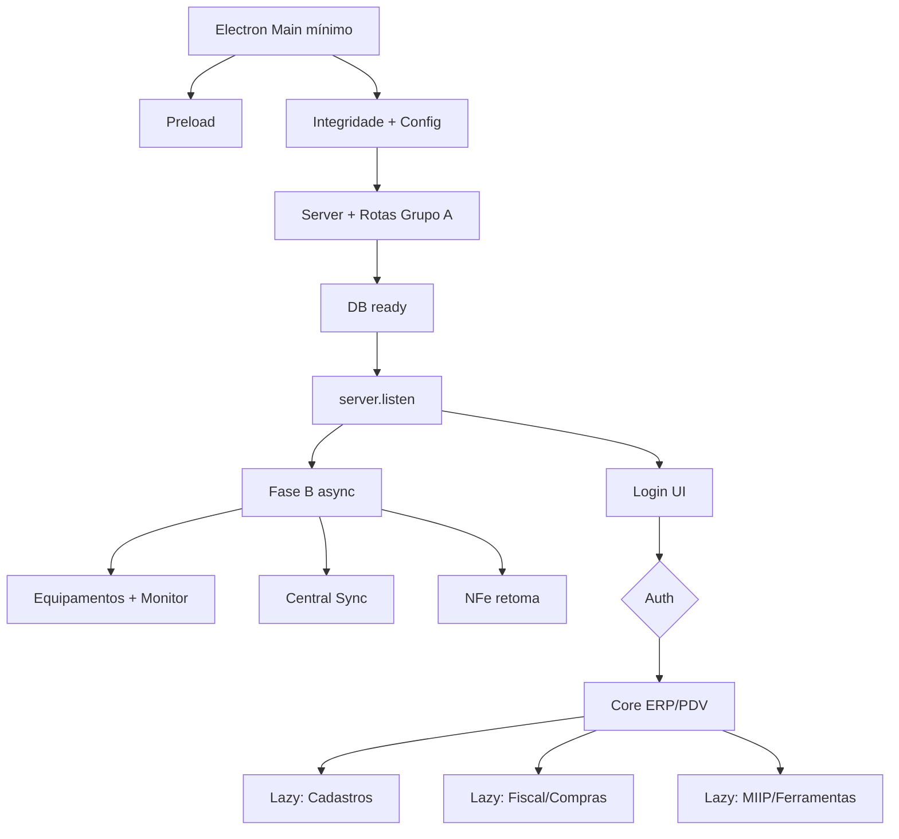

# BOOT INTELIGENTE V1 — Arquitetura Oficial de Inicialização

**Documento:** `docs/oficial/performance/BOOT_INTELIGENTE_RC11_1.md`  
**Sprint de origem:** RC11.1.0 (READ-ONLY)  
**Base empírica:** `docs/historico/rcs/rc11/RELATORIO_RC11_0_1_AUDITORIA_PERFORMANCE.md`  
**Status:** **ARQUITETURA OFICIAL** para a série RC11.x  
**Data:** 2026-07-26  
**Confidence:** 1.00  

**Garantias desta sprint:** nenhum código, banco, API, Electron, `package.json`, licenciamento ou motor foi alterado. Somente este documento.

---

## 1. Resumo executivo

### Problema

O boot atual do CDS acopla, **antes** de `server.listen` e da tela de login:

1. Grafo completo de `require` das rotas (`backend/server.js`, ~63 requires)
2. Migrações/schema SQLite monólito (`backend/database.js`, ~3260 linhas)
3. Inicialização de **Motor de Equipamentos + Monitor + Integração RC5**
4. **Central Sync Background** + retomada de consultas NF-e
5. No renderer ERP: **65 scripts** (~2,1 MB) em eager load

Isso aumenta TTI (Time to Interactive) do login e do shell ERP sem benefício proporcional para o usuário que ainda não autenticou.

### Objetivo do Boot Inteligente V1

Redesenhar a **ordem e o momento** da inicialização, preservando 100% das regras de negócio:

- **Login disponível o mais cedo possível** após DB + bootstrap mínimo
- Motores e sync em **fase pós-listen / assíncrona**
- Módulos ERP/PDV/MIIP/ferramentas em **lazy load sob demanda**
- Instrumentação oficial de métricas de boot (RC dedicada)

### Princípios (imutáveis)

| Princípio | Significado |
|-----------|-------------|
| P1 — Segurança primeiro | Auth, licença e gate de API não podem ser adiados de forma insegura |
| P2 — Listen cedo | `server.listen` imediatamente após DB ready + rotas essenciais montáveis |
| P3 — Sem mudança de contrato | Endpoints, payloads e permissões permanecem idênticos |
| P4 — Fail-closed em fiscal/equipamentos | Adiar init ≠ desligar feature; estados “aquecendo” devem ser explícitos |
| P5 — Medir antes de otimizar cegamente | Toda RC de execução publica deltas de boot |

---

## 2. Fase 1 — Inventário do boot atual

### 2.1 Sequência real (as-is)

| # | Etapa | Arquivo(s) responsável(is) | Tempo estimado* | Dependências | Ordem obrigatória? | Motivo técnico |
|---|-------|----------------------------|-----------------|--------------|--------------------|----------------|
| 1 | Electron Main | `electron.js` **ou** `electron-common.js` (+ `electron-diagnostico`, `electron-integrity`, `electron-auditoria-rc3164`) | 200–800 ms | Chromium/Electron | Sim | Processo hospedeiro; IPC; GPU off; HTTP cache off |
| 2 | Preload | `preload.js` | < 50 ms | contextIsolation | Sim | Bridge segura `electronAPI` |
| 3 | Bootstrap Main pós-ready | dirs `DB_DIR`/`FISCAL_DIR`, integridade ASAR, config rede | 100–1500 ms | FS, manifesto | Sim (integridade) | Evita pacote inconsistente |
| 4 | Require Express | `backend/server.js` | 500–3000 ms | Node module graph | Sim hoje | Monta app + **todas** as rotas sync |
| 5 | Database open + schema | `backend/database.js` | 500–5000+ ms | SQLite file em ProgramData | Sim | `whenReady` antes do listen (anti SQLITE_BUSY) |
| 6 | Rotas HTTP | `backend/rotas/*` via requires em `server.js` | incluso em #4 | Express, middlewares | Parcial | Auth/licença essenciais; demais podem ser lazy |
| 7 | Pós-DB sync (bloqueia listen) | MIP hydrate, sync financeiro canceladas | 50–500 ms | DB | Desejável cedo / adiáve | Flags e consistência |
| 8 | Motores Equipamentos | `motores/equipamentos`, `MonitorService`, integração RC5 | 200–2000 ms | DB, drivers | **Não** para login | Hoje roda **antes** do listen |
| 9 | Background Central/NFe | `CentralSyncBackgroundService`, `nfeOperacionalService` | 100–∞ (SEFAZ) | DB, rede | **Não** para login | Hoje `await` antes do listen |
| 10 | `server.listen` | `server.js` | < 50 ms | #5 | Sim | Porta HTTP |
| 11 | Renderer Login | `frontend/shared/login.html` + ~10 scripts | 200–800 ms | #10 | Sim | Primeira UI útil |
| 12 | ERP shell | `frontend/erp/index.html` + **65 scripts** | 1–5+ s | token, #10 | Após login | Eager load monolítico |
| 13 | PDV shell | `frontend/pdv/index.html` + **28 scripts** | 0,5–2 s | token, recurso `pdv` | Após login | Menor que ERP |
| 14 | Demais módulos UI | produtos, fiscal, MIIP UI, lab, etc. | já no #12 | — | Sob demanda (alvo) | Hoje já estão no heap |

\*Estimativas qualitativas da RC11.0.1 (sem telemetria instrumentada). Valores absolutos virão na RC11.7.

### 2.2 Fluxograma atual (as-is)



**Bloqueio crítico:** tudo entre G→K ocorre **antes** da primeira tela.

---

## 3. Fase 2 — Classificação dos serviços

### GRUPO A — Obrigatórios antes do `listen`

| Serviço / componente | Justificativa |
|----------------------|---------------|
| Abertura SQLite + pragmas WAL | Sem DB não há auth nem config |
| Subconjunto mínimo de schema para login/sessão/usuários/config | Login e token |
| `configuracaoService` (ensure + reload) | Modo rede, recursos, branding |
| Middleware `auth` + `apiAuthLicencaGate` | Segurança e licença (P1) |
| Rotas `/api/auth`, `/api/licenca`, ping, estáticos frontend/branding | Login funcional |
| Rota GET `/login` + assets shared | UI de entrada |
| (Opcional controlado) hidratação leve de flags que afetam gate de rota | Evitar 404/403 inconsistente |

**Não** inclui: sync SEFAZ, discovery de balanças, schedulers, UI ERP.

### GRUPO B — Imediatamente após `listen` (async, não bloqueia login)

| Serviço | Justificativa |
|---------|---------------|
| Motor Equipamentos + DriverManager | Necessário cedo para PDV/balança, mas **depois** da porta aberta |
| `MonitorService` (heartbeat 4s) | Pode aquecer em background |
| Integração Equipamentos RC5 | Event bus / corporate hooks |
| `CentralSyncBackgroundService` | Sync DF-e contínuo |
| `nfeOperacional.garantirSchemaOperacional` + `retomarConsultasPendentes` | Retoma com backoff; não deve segurar listen |
| Sync financeiro de vendas canceladas | Consistência; pode ser B ou C |
| MIP `hidratarFlagDoBanco` | Preferir A se altera montagem de rotas; senão B |

**Contrato UI:** APIs de equipamentos/central podem responder `503 warming` ou fila interna até `ready` — **sem mudar regra de negócio**, apenas observabilidade de estado.

### GRUPO C — Após login (sessão autenticada)

| Serviço / módulo | Justificativa |
|------------------|---------------|
| Shell ERP / PDV (HTML + core) | Só após token |
| Cadastros (produtos, clientes, fornecedores, categorias…) | Uso pós-login |
| Financeiro / contas a receber | Idem |
| Fiscal UI / NFe central UI / DF-e UI | Idem |
| Compras / Central Entradas UI | Idem |
| Faturamento / pedidos / caixa multi | Idem |
| Dashboard / monitoring UI | Idem |
| Configurações avançadas / TEF UI | Idem |

### GRUPO D — Sob demanda (lazy)

| Serviço / módulo | Justificativa |
|------------------|---------------|
| MIIP (engines + UI central revisão) | Pipeline pesado; uso em compras/XML |
| Upload XML / importação avançada | Evento de usuário |
| Laboratório de equipamentos | Ferramenta de engenharia |
| Engenharia reversa Toledo | Niche; paths sensíveis |
| Homologação assistida UI | Operação pontual |
| Auditorias / relatórios pesados / Chart.js views | Não críticos ao first paint |
| Motor Comercial / MTS deep paths | Já sob demanda nas rotas; evitar require eagerly se possível |
| Backup UI / ferramentas admin | Frequência baixa |

---

## 4. Fase 3 — Grafo de dependências

### 4.1 Quem depende de quem?



### 4.2 Respostas objetivas

| Pergunta | Resposta |
|----------|----------|
| Quem **bloqueia** o boot hoje? | `database.js` (schema), requires de rotas, awaits de Equipamentos/Central/NFe antes do listen, eager ERP scripts |
| Quem pode ser **isolado**? | Lab, engenharia reversa, MIIP engines, Chart/dashboard, homologação |
| Quem pode ser **Lazy Load**? | Quase todo o ERP por menu; rotas D; MIIP; schedulers já em B |
| Quem pode iniciar em **paralelo** pós-listen? | Equipamentos ∥ CentralSync ∥ NFe retoma ∥ (opcional) sync financeiro — com limites de pool SQLite |
| Quem **não** pode ser paralelo com login inseguro? | Auth + licença + DB mínimo |

### 4.3 Isolamento seguro (candidatos)

- `engenharia-reversa` / `laboratorio-equipamentos` → dynamic `require` na primeira hit da rota  
- `miip` routes → lazy router  
- Frontend: não incluir `central-entradas.js` / `produtos.js` até navegação  
- Chart.js só no dashboard  

---

## 5. Fase 4 — Pipeline oficial proposto (to-be)

### 5.1 Pipeline Boot Inteligente V1

```text
Electron Main (mínimo)
    ↓
Preload
    ↓
Bootstrap mínimo (dirs, integridade, config rede)
    ↓
Server Express + rotas GRUPO A + static
    ↓
Database ready (schema mínimo / versionado)
    ↓
server.listen  ←── LOGIN DISPONÍVEL
    ↓
Renderer /login
    ↓
[paralelo] Fase B: Equipamentos, Monitor, Central Sync, NFe retoma
    ↓
Login OK
    ↓
Shell ERP/PDV (core apenas)
    ↓
Carga sob demanda GRUPO C/D por navegação/API
```

### 5.2 Fluxograma proposto



### 5.3 Estados oficiais do runtime

| Estado | Significado | UI/API |
|--------|-------------|--------|
| `BOOTSTRAPPING` | Antes do listen | Splash Electron opcional |
| `LOGIN_READY` | Listen OK, Fase B pode estar running | `/login` |
| `RUNTIME_WARMING` | Motores B ainda iniciando | APIs B: ready=false tolerante |
| `RUNTIME_READY` | Fase B concluída (ou degradada com log) | Operação plena |
| `SESSION_ACTIVE` | Usuário autenticado | Shell C |
| `MODULE_LOADED:<id>` | Módulo D/C carregado | Feature disponível |

---

## 6. Fase 5 — Roadmap de implementação (RCs)

| RC | Objetivo | Complexidade | Impacto | Risco | Tempo estimado |
|----|----------|--------------|---------|-------|----------------|
| **RC11.2 — Boot não bloqueante** | Mover awaits de Equipamentos/Central/NFe para **depois** de `listen`; login antecipado | Média | **Alto** (TTI login) | Médio (corrida PDV cedo vs monitor) | 2–4 dias |
| **RC11.3 — Lazy Services** | Dynamic require de lab/engenharia/miip routers; flags `warming` | Média | Médio–Alto (RAM Node) | Médio | 3–5 dias |
| **RC11.4 — Lazy ERP** | Particionar `erp/index.html`: core + loaders por menu; remover cross-import PDV desnecessário | Alta | **Muito alto** (TTI ERP) | Médio–Alto (ordem globals jQuery) | 1–2 semanas |
| **RC11.5 — Lazy MIIP** | Engines MIIP só no primeiro uso (import XML / central revisão) | Média | Médio | Médio | 3–5 dias |
| **RC11.6 — Background Scheduler** | Orquestrador único pós-listen (fila, backoff, cancelamento no shutdown) para Central/NFe/Monitor | Alta | Alto (estabilidade CPU) | Médio | 1 semana |
| **RC11.7 — Boot Metrics** | Timestamps estruturados: Main, DB ready, listen, DOMContentLoaded, ERP interactive; endpoint/diag Electron | Baixa–Média | Alto (governança) | Baixo | 2–3 dias |
| **RC11.8 — Schema version** *(extensão recomendada)* | Migrar `database.js` para delta versionado | Alta | **Muito alto** (boot DB) | **Alto** | 1–2 semanas |

**Ordem recomendada:** RC11.7 (métricas baseline) → RC11.2 → RC11.6 → RC11.3 → RC11.4 → RC11.5 → RC11.8.

> Nota: RC11.0.1 já sugeria instrumentação como 11.0.2; neste plano oficial a telemetria consolida-se como **RC11.7**, podendo ser antecipada sem conflito.

---

## 7. Fase 6 — Métricas e ganhos estimados

### 7.1 Situação atual (estimativa estrutural)

| Métrica | Estimativa atual |
|---------|------------------|
| Tempo até login (local frio) | ~3–10 s (máquina típica Windows) |
| Tempo até ERP “completo” pós-login | +2–6 s (parse 65 scripts) |
| Serviços bloqueando listen | ≥ 4 (Equipamentos, Monitor/Integração, CentralSync, NFe) |
| Imports/rotas eager no Node | ~40 mounts `/api/*` |
| Heap renderer ERP | Parse de ~2,1 MB JS + vendor |

### 7.2 Esperado após Boot Inteligente V1 (RC11.2–11.5)

| Métrica | Alvo |
|---------|------|
| Tempo até login | **−30% a −60%** vs baseline medido |
| Tempo até shell ERP utilizável (core) | **−40% a −70%** com lazy ERP |
| Serviços adiados do caminho crítico | **4+** (Grupo B) |
| Imports/rotas adiados | **5–15** routers Grupo D + scripts ERP |
| Ganho memória Node | **−10% a −25%** com lazy routers |
| Ganho memória Renderer | **−30% a −50%** no first paint ERP |
| Ganho CPU contínuo | Monitor/schedulers controlados (RC11.6): **−20% a −40%** idle |
| Impacto percebido | Login “abre rápido”; menus carregam ao clicar; PDV menos afetado (já menor) |

### 7.3 Critérios quantitativos de aceite (por RC)

Cada RC de execução deve publicar no relatório:

- `t_main_ready`, `t_db_ready`, `t_listen`, `t_login_fcp`, `t_erp_core`, `t_runtime_ready`
- Delta % vs baseline RC11.7
- Regressão zero em testes âncora (auth, licença, venda PDV smoke, NFe schema)

---

## 8. Checklist de validação (RC11.1.0)

| Item | Status |
|------|--------|
| Nenhum arquivo de código alterado | ✓ |
| Nenhum banco alterado | ✓ |
| Nenhuma API/contrato alterado | ✓ |
| Electron / package.json / lock inalterados | ✓ |
| Licenciamento / motores inalterados | ✓ |
| Documento oficial criado em `docs/oficial/performance/` | ✓ |
| Serve como constituição da série RC11 | ✓ |

---

## 9. Referências

- RC11.0.1 — Auditoria de performance: `docs/historico/rcs/rc11/RELATORIO_RC11_0_1_AUDITORIA_PERFORMANCE.md`
- Bootstrap: `electron.js`, `electron-common.js`, `preload.js`
- Backend: `backend/server.js` (linhas pós-`whenReady` ~282–338), `backend/database.js`
- UI: `frontend/shared/login.html`, `frontend/erp/index.html`, `frontend/pdv/index.html`

---

## 10. Aprovação para execução

Este documento **não autoriza** mudanças de código.  
A implementação inicia somente com aprovação explícita da **RC11.2** (ou RC11.7 se métricas forem antecipadas).

*Fim — BOOT INTELIGENTE V1 (RC11.1.0)*